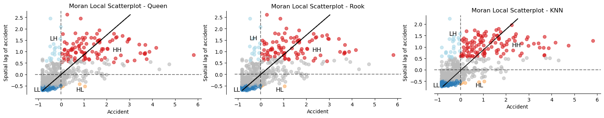

# Cluster Analysis of e-Scooter Accidents in London between 2018-2022

The cluster analysis of e-Scooter accidents in London from 2018 to 2022 aims to determine whether these accidents occur randomly or exhibit evidence of spatial clustering. To address this, various analytical processes are undertaken using global and local spatial autocorrelation. The initial method involves calculating spatial weights, comparing contiguity approaches (queen and rook), and employing K-Nearest Neighbors with k=8. Subsequently, spatial lag and Moran's I are computed. The second method incorporates local Moran's I and local indicators of spatial association (LISA) to provide a more comprehensive analysis of spatial patterns.

# Initial Steps

## Libraries to use

Several packages will be used in this spatial analysis:

- **Pandas (`pd`):** Utilized for reading and manipulating tabular data.
- **Geopandas (`gpd`):** Specialized for working with geospatial data, enabling the creation and manipulation of spatial data framext.
- **esda (Exploratory Spatial Data Analysis):** A component of PySAL, facilitating exploratory spatial data analysis, including Moran's I and local indicators of spatial association (LISA).
- **splot:** A PySAL library designed for visualizing spatial statistics.
- **libpysal (`lps`):** The core PySAL library for spatial analysis.
- **PySAL.weights:** Submodule used for generating spatial weight matrices (e.g., Queen, Rook) crucial for spatial analysis.
- **Matplotlib (`plt`):** A popular plotting library for creating static, interactive, and 3D visualizations.
- **Plotly Express (`px`):** Applied for interactive visualizations, especially beneficial for maps.
- **Matplotlib.patches (`mpatches`):** Provides functionality for creating and manipulating graphical patches (e.g., shapes,ical testing.


```python
# Importing all necessary packages for this analysis
# to read and wrangle data
import pandas as pd

# to create spatial data
import geopandas as gpd

# for spatial statistics
import esda
from esda.moran import Moran, Moran_Local

import splot
from splot.esda import moran_scatterplot, plot_moran, lisa_cluster, plot_moran_simulation

import libpysal as lps
from libpysal.weights import Queen, Rook

# for graphics
import matplotlib.pyplot as plt
import plotly.express as px
import matplotlib.patches as mpatches
```

## Data loading: GeoDataFrame

The geodataframe used in this analysis is London Ward that consists of 633 wards from 33 boroughs. The data is downloaded from London Datastore via https://data.london.gov.uk/download/statistical-gis-boundary-files-london/08d31995-dd27-423c-a987-57fe8e952990/London-wards-2018.zip

Through this analysis, the mapping unit used is ward as geodataframe. In addition, borough geodataframe is also generated for visualisation purpose. The Coordinate Reference System (CRS) utilised for the calculation is metric, specifically EPSG 27700 - OSGB36 / British National Grid. However, visualisation of LISA result later should use Web Mercator CRS, specifically EPSG 3857.


```python
# Loading the shapefile
london_ward = gpd.read_file('data/London_Ward_CityMerged.shp')
```


```python
# Check the datatype
london_ward.info()
```

    <class 'geopandas.geodataframe.GeoDataFrame'>
    RangeIndex: 633 entries, 0 to 632
    Data columns (total 7 columns):
     #   Column      Non-Null Count  Dtype   
    ---  ------      --------------  -----   
     0   NAME        633 non-null    object  
     1   GSS_CODE    633 non-null    object  
     2   DISTRICT    633 non-null    object  
     3   LAGSSCODE   633 non-null    object  
     4   HECTARES    633 non-null    float64 
     5   NONLD_AREA  633 non-null    float64 
     6   geometry    633 non-null    geometry
    dtypes: float64(2), geometry(1), object(4)
    memory usage: 34.7+ KB
    


```python
# Lowercase the column names
london_ward = london_ward.rename(columns=lambda x: x.lower())

# Then rename the column 'name' to 'ward'
london_ward.rename(columns={'name': 'ward', 'district': 'borough'}, inplace=True)

# Check the result
london_ward.info()
```

    <class 'geopandas.geodataframe.GeoDataFrame'>
    RangeIndex: 633 entries, 0 to 632
    Data columns (total 7 columns):
     #   Column      Non-Null Count  Dtype   
    ---  ------      --------------  -----   
     0   ward        633 non-null    object  
     1   gss_code    633 non-null    object  
     2   borough     633 non-null    object  
     3   lagsscode   633 non-null    object  
     4   hectares    633 non-null    float64 
     5   nonld_area  633 non-null    float64 
     6   geometry    633 non-null    geometry
    dtypes: float64(2), geometry(1), object(4)
    memory usage: 34.7+ KB
    


```python
# Inspect the table
london_ward
```


<div>
<style scoped>
    .dataframe tbody tr th:only-of-type {
        vertical-align: middle;
    }

    .dataframe tbody tr th {
        vertical-align: top;
    }

    .dataframe thead th {
        text-align: right;
    }
</style>
<table border="1" class="dataframe">
  <thead>
    <tr style="text-align: right;">
      <th></th>
      <th>ward</th>
      <th>gss_code</th>
      <th>borough</th>
      <th>lagsscode</th>
      <th>hectares</th>
      <th>nonld_area</th>
      <th>geometry</th>
    </tr>
  </thead>
  <tbody>
    <tr>
      <th>0</th>
      <td>Chessington South</td>
      <td>E05000405</td>
      <td>Kingston upon Thames</td>
      <td>E09000021</td>
      <td>755.173</td>
      <td>0.000</td>
      <td>POLYGON ((516401.596 160201.802, 516407.302 16...</td>
    </tr>
    <tr>
      <th>1</th>
      <td>Tolworth and Hook Rise</td>
      <td>E05000414</td>
      <td>Kingston upon Thames</td>
      <td>E09000021</td>
      <td>259.464</td>
      <td>0.000</td>
      <td>POLYGON ((519552.998 164295.600, 519508.096 16...</td>
    </tr>
    <tr>
      <th>2</th>
      <td>Berrylands</td>
      <td>E05000401</td>
      <td>Kingston upon Thames</td>
      <td>E09000021</td>
      <td>145.390</td>
      <td>0.000</td>
      <td>POLYGON ((518107.499 167303.399, 518114.301 16...</td>
    </tr>
    <tr>
      <th>3</th>
      <td>Alexandra</td>
      <td>E05000400</td>
      <td>Kingston upon Thames</td>
      <td>E09000021</td>
      <td>268.506</td>
      <td>0.000</td>
      <td>POLYGON ((520336.700 165105.498, 520332.198 16...</td>
    </tr>
    <tr>
      <th>4</th>
      <td>Beverley</td>
      <td>E05000402</td>
      <td>Kingston upon Thames</td>
      <td>E09000021</td>
      <td>187.821</td>
      <td>0.000</td>
      <td>POLYGON ((521201.203 169275.505, 521204.303 16...</td>
    </tr>
    <tr>
      <th>...</th>
      <td>...</td>
      <td>...</td>
      <td>...</td>
      <td>...</td>
      <td>...</td>
      <td>...</td>
      <td>...</td>
    </tr>
    <tr>
      <th>628</th>
      <td>Whalebone</td>
      <td>E05000042</td>
      <td>Barking and Dagenham</td>
      <td>E09000002</td>
      <td>155.399</td>
      <td>0.000</td>
      <td>POLYGON ((549410.698 187450.702, 549391.199 18...</td>
    </tr>
    <tr>
      <th>629</th>
      <td>Eastbrook</td>
      <td>E05000030</td>
      <td>Barking and Dagenham</td>
      <td>E09000002</td>
      <td>345.060</td>
      <td>0.000</td>
      <td>POLYGON ((549991.497 184928.504, 549988.899 18...</td>
    </tr>
    <tr>
      <th>630</th>
      <td>Chadwell Heath</td>
      <td>E05000029</td>
      <td>Barking and Dagenham</td>
      <td>E09000002</td>
      <td>338.422</td>
      <td>0.000</td>
      <td>POLYGON ((548874.200 188496.303, 548843.199 18...</td>
    </tr>
    <tr>
      <th>631</th>
      <td>Parsloes</td>
      <td>E05000037</td>
      <td>Barking and Dagenham</td>
      <td>E09000002</td>
      <td>124.384</td>
      <td>0.000</td>
      <td>POLYGON ((547381.597 185753.598, 547377.499 18...</td>
    </tr>
    <tr>
      <th>632</th>
      <td>Castle Baynard</td>
      <td>E05009297</td>
      <td>City and County of the City of London</td>
      <td>E09000001</td>
      <td>314.943</td>
      <td>24.546</td>
      <td>POLYGON ((531361.303 180690.997, 531313.201 18...</td>
    </tr>
  </tbody>
</table>
<p>633 rows × 7 columns</p>
</div>


```python
# Check the current CRS
print(london_ward.crs)
```

    EPSG:27700
    

### Dissolve to London borough

London borough is only used for visualisation.


```python
# Do dissolve to generate London borough gdf
london_borough = london_ward.dissolve(by='lagsscode', as_index=False)

# Delete columns of ward and gss_code
london_borough = london_borough.drop(columns=['ward', 'gss_code'])

# Show the result
london_borough
```


<div>
<style scoped>
    .dataframe tbody tr th:only-of-type {
        vertical-align: middle;
    }

    .dataframe tbody tr th {
        vertical-align: top;
    }

    .dataframe thead th {
        text-align: right;
    }
</style>
<table border="1" class="dataframe">
  <thead>
    <tr style="text-align: right;">
      <th></th>
      <th>lagsscode</th>
      <th>geometry</th>
      <th>borough</th>
      <th>hectares</th>
      <th>nonld_area</th>
    </tr>
  </thead>
  <tbody>
    <tr>
      <th>0</th>
      <td>E09000001</td>
      <td>POLYGON ((531361.303 180690.997, 531313.201 18...</td>
      <td>City and County of the City of London</td>
      <td>314.943</td>
      <td>24.546</td>
    </tr>
    <tr>
      <th>1</th>
      <td>E09000002</td>
      <td>POLYGON ((545714.899 181642.305, 545678.901 18...</td>
      <td>Barking and Dagenham</td>
      <td>113.874</td>
      <td>4.906</td>
    </tr>
    <tr>
      <th>2</th>
      <td>E09000003</td>
      <td>POLYGON ((523293.197 186457.696, 523239.200 18...</td>
      <td>Barnet</td>
      <td>455.053</td>
      <td>0.000</td>
    </tr>
    <tr>
      <th>3</th>
      <td>E09000004</td>
      <td>POLYGON ((547962.296 170556.398, 547957.399 17...</td>
      <td>Bexley</td>
      <td>188.689</td>
      <td>0.000</td>
    </tr>
    <tr>
      <th>4</th>
      <td>E09000005</td>
      <td>POLYGON ((521058.398 183113.004, 521051.002 18...</td>
      <td>Brent</td>
      <td>267.991</td>
      <td>0.000</td>
    </tr>
    <tr>
      <th>5</th>
      <td>E09000006</td>
      <td>POLYGON ((540344.998 157603.096, 540339.803 15...</td>
      <td>Bromley</td>
      <td>2903.960</td>
      <td>0.000</td>
    </tr>
    <tr>
      <th>6</th>
      <td>E09000007</td>
      <td>POLYGON ((527578.700 183595.996, 527478.003 18...</td>
      <td>Camden</td>
      <td>125.671</td>
      <td>0.000</td>
    </tr>
    <tr>
      <th>7</th>
      <td>E09000008</td>
      <td>POLYGON ((532849.503 157330.104, 532867.502 15...</td>
      <td>Croydon</td>
      <td>452.138</td>
      <td>0.000</td>
    </tr>
    <tr>
      <th>8</th>
      <td>E09000009</td>
      <td>POLYGON ((510854.302 179385.201, 510880.002 17...</td>
      <td>Ealing</td>
      <td>379.609</td>
      <td>0.000</td>
    </tr>
    <tr>
      <th>9</th>
      <td>E09000010</td>
      <td>POLYGON ((532296.400 191733.696, 532294.702 19...</td>
      <td>Enfield</td>
      <td>1693.541</td>
      <td>0.000</td>
    </tr>
    <tr>
      <th>10</th>
      <td>E09000011</td>
      <td>POLYGON ((544422.601 172610.400, 544429.700 17...</td>
      <td>Greenwich</td>
      <td>329.143</td>
      <td>0.000</td>
    </tr>
    <tr>
      <th>11</th>
      <td>E09000012</td>
      <td>POLYGON ((532725.300 183746.502, 532745.203 18...</td>
      <td>Hackney</td>
      <td>102.355</td>
      <td>0.000</td>
    </tr>
    <tr>
      <th>12</th>
      <td>E09000013</td>
      <td>POLYGON ((523289.396 177427.701, 523269.798 17...</td>
      <td>Hammersmith and Fulham</td>
      <td>148.083</td>
      <td>34.321</td>
    </tr>
    <tr>
      <th>13</th>
      <td>E09000014</td>
      <td>POLYGON ((531329.403 186915.195, 531310.101 18...</td>
      <td>Haringey</td>
      <td>249.482</td>
      <td>0.000</td>
    </tr>
    <tr>
      <th>14</th>
      <td>E09000015</td>
      <td>POLYGON ((514368.999 185743.601, 514226.203 18...</td>
      <td>Harrow</td>
      <td>157.492</td>
      <td>0.000</td>
    </tr>
    <tr>
      <th>15</th>
      <td>E09000016</td>
      <td>POLYGON ((550929.199 180477.998, 550901.397 18...</td>
      <td>Havering</td>
      <td>2253.736</td>
      <td>0.000</td>
    </tr>
    <tr>
      <th>16</th>
      <td>E09000017</td>
      <td>POLYGON ((507143.200 174195.696, 507136.901 17...</td>
      <td>Hillingdon</td>
      <td>2352.117</td>
      <td>0.000</td>
    </tr>
    <tr>
      <th>17</th>
      <td>E09000018</td>
      <td>POLYGON ((512480.896 173024.302, 512552.999 17...</td>
      <td>Hounslow</td>
      <td>444.841</td>
      <td>0.000</td>
    </tr>
    <tr>
      <th>18</th>
      <td>E09000019</td>
      <td>POLYGON ((530418.497 182999.296, 530364.797 18...</td>
      <td>Islington</td>
      <td>93.263</td>
      <td>0.000</td>
    </tr>
    <tr>
      <th>19</th>
      <td>E09000020</td>
      <td>POLYGON ((524931.400 178525.597, 524903.697 17...</td>
      <td>Kensington and Chelsea</td>
      <td>69.412</td>
      <td>15.654</td>
    </tr>
    <tr>
      <th>20</th>
      <td>E09000021</td>
      <td>POLYGON ((516427.898 160231.304, 516453.804 16...</td>
      <td>Kingston upon Thames</td>
      <td>755.173</td>
      <td>0.000</td>
    </tr>
    <tr>
      <th>21</th>
      <td>E09000022</td>
      <td>POLYGON ((529494.704 170662.798, 529530.297 17...</td>
      <td>Lambeth</td>
      <td>169.809</td>
      <td>0.000</td>
    </tr>
    <tr>
      <th>22</th>
      <td>E09000023</td>
      <td>POLYGON ((535205.703 171119.997, 535189.897 17...</td>
      <td>Lewisham</td>
      <td>308.471</td>
      <td>0.000</td>
    </tr>
    <tr>
      <th>23</th>
      <td>E09000024</td>
      <td>POLYGON ((524032.103 166124.397, 524016.800 16...</td>
      <td>Merton</td>
      <td>222.344</td>
      <td>0.000</td>
    </tr>
    <tr>
      <th>24</th>
      <td>E09000025</td>
      <td>POLYGON ((539596.198 180264.199, 539576.401 18...</td>
      <td>Newham</td>
      <td>473.052</td>
      <td>142.283</td>
    </tr>
    <tr>
      <th>25</th>
      <td>E09000026</td>
      <td>POLYGON ((540037.004 186246.097, 540008.500 18...</td>
      <td>Redbridge</td>
      <td>474.224</td>
      <td>0.000</td>
    </tr>
    <tr>
      <th>26</th>
      <td>E09000027</td>
      <td>POLYGON ((517511.604 167905.697, 517491.403 16...</td>
      <td>Richmond upon Thames</td>
      <td>687.724</td>
      <td>0.000</td>
    </tr>
    <tr>
      <th>27</th>
      <td>E09000028</td>
      <td>POLYGON ((533649.802 170847.905, 533648.796 17...</td>
      <td>Southwark</td>
      <td>301.593</td>
      <td>0.000</td>
    </tr>
    <tr>
      <th>28</th>
      <td>E09000029</td>
      <td>POLYGON ((525270.198 161615.897, 525232.601 16...</td>
      <td>Sutton</td>
      <td>705.342</td>
      <td>0.000</td>
    </tr>
    <tr>
      <th>29</th>
      <td>E09000030</td>
      <td>POLYGON ((533472.599 180347.695, 533470.398 18...</td>
      <td>Tower Hamlets</td>
      <td>149.089</td>
      <td>42.323</td>
    </tr>
    <tr>
      <th>30</th>
      <td>E09000031</td>
      <td>POLYGON ((537560.797 185584.696, 537544.101 18...</td>
      <td>Waltham Forest</td>
      <td>203.218</td>
      <td>0.000</td>
    </tr>
    <tr>
      <th>31</th>
      <td>E09000032</td>
      <td>POLYGON ((526320.800 171816.197, 526315.004 17...</td>
      <td>Wandsworth</td>
      <td>442.415</td>
      <td>0.000</td>
    </tr>
    <tr>
      <th>32</th>
      <td>E09000033</td>
      <td>POLYGON ((525804.503 180580.599, 525724.402 18...</td>
      <td>City of Westminster</td>
      <td>346.379</td>
      <td>27.146</td>
    </tr>
  </tbody>
</table>
</div>


```python
# Check the CRS
print(london_borough.crs)
```

    EPSG:27700
    


```python
# Show the shapefile
fig, ax = plt.subplots(figsize=(5, 5))

# Plot london borough
london_borough.boundary.plot(ax=ax, color="white", linewidth=1, alpha=0.25)

# Plot London ward
london_ward.plot(ax=ax)

plt.title('London Ward Map')
plt.show()
```


    

    


## Data loading: DataFrame

In this analysis, Road Safety Data from the Department for Transport (DfT) spanning the last five years is utilised. The dataset comprises three distinct files, each capturing specific facets of road accidents:

1. Road Safety - Casualties last 5 years (https://data.dft.gov.uk/road-accidents-safety-data/dft-road-casualty-statistics-vehicle-last-5-years.csv)
2. Road Safety - Vehicles last 5 years (https://data.dft.gov.uk/road-accidents-safety-data/dft-road-casualty-statistics-collision-last-5-years.csv)
3. Road Safety - Collisions last 5 years (https://data.dft.gov.uk/road-accidents-safety-data/dft-road-casualty-statistics-casualty-last-5-years.csv)

These datasets collectively document road accident occurrences in the UK from 2018 to 2022.


```python
# Load the tabular data with low_memory=False
# accident by vehicle details
uk_vehicle = pd.read_csv("data/dft-road-casualty-statistics-vehicle-last-5-years.csv", low_memory=False) 

# accident by collision details
uk_collision = pd.read_csv("data/dft-road-casualty-statistics-collision-last-5-years.csv", low_memory=False) 

# accident by casualty details
uk_casualty = pd.read_csv("data/dft-road-casualty-statistics-casualty-last-5-years.csv", low_memory=False)
```

## Data wrangling/cleanup

The analytical process involves converting these datasets into dataframes and performing various data wrangling steps. These steps include merging the datasets, selecting essential columns, subsetting the data to focus on the London boundary, and cleaning the data by handling missing values and converting text to lowercase. Subsequently, the dataframe is converted into a geodataframe to facilitate subsequent spatial analyses.

### Merge, trim, subset, and clean data


```python
# Merge the three dataframe into one
uk_accident = pd.merge(uk_vehicle, uk_collision, on="accident_index").merge(uk_casualty, on="accident_index")

# Check the merge result
uk_accident.info()
```

    <class 'pandas.core.frame.DataFrame'>
    RangeIndex: 1331943 entries, 0 to 1331942
    Data columns (total 81 columns):
     #   Column                                       Non-Null Count    Dtype  
    ---  ------                                       --------------    -----  
     0   accident_index                               1331943 non-null  object 
     1   accident_year_x                              1331943 non-null  int64  
     2   accident_reference_x                         1331943 non-null  object 
     3   vehicle_reference_x                          1331943 non-null  int64  
     4   vehicle_type                                 1331943 non-null  int64  
     5   towing_and_articulation                      1331943 non-null  int64  
     6   vehicle_manoeuvre                            1331943 non-null  int64  
     7   vehicle_direction_from                       1331943 non-null  int64  
     8   vehicle_direction_to                         1331943 non-null  int64  
     9   vehicle_location_restricted_lane             1331943 non-null  int64  
     10  junction_location                            1331943 non-null  int64  
     11  skidding_and_overturning                     1331943 non-null  int64  
     12  hit_object_in_carriageway                    1331943 non-null  int64  
     13  vehicle_leaving_carriageway                  1331943 non-null  int64  
     14  hit_object_off_carriageway                   1331943 non-null  int64  
     15  first_point_of_impact                        1331943 non-null  int64  
     16  vehicle_left_hand_drive                      1331943 non-null  int64  
     17  journey_purpose_of_driver                    1331943 non-null  int64  
     18  sex_of_driver                                1331943 non-null  int64  
     19  age_of_driver                                1331943 non-null  int64  
     20  age_band_of_driver                           1331943 non-null  int64  
     21  engine_capacity_cc                           1331943 non-null  int64  
     22  propulsion_code                              1331943 non-null  int64  
     23  age_of_vehicle                               1331943 non-null  int64  
     24  generic_make_model                           1331943 non-null  object 
     25  driver_imd_decile                            1331943 non-null  int64  
     26  driver_home_area_type                        1331943 non-null  int64  
     27  lsoa_of_driver                               1331943 non-null  object 
     28  accident_year_y                              1331943 non-null  int64  
     29  accident_reference_y                         1331943 non-null  object 
     30  location_easting_osgr                        1331608 non-null  float64
     31  location_northing_osgr                       1331608 non-null  float64
     32  longitude                                    1331608 non-null  float64
     33  latitude                                     1331608 non-null  float64
     34  police_force                                 1331943 non-null  int64  
     35  accident_severity                            1331943 non-null  int64  
     36  number_of_vehicles                           1331943 non-null  int64  
     37  number_of_casualties                         1331943 non-null  int64  
     38  date                                         1331943 non-null  object 
     39  day_of_week                                  1331943 non-null  int64  
     40  time                                         1331943 non-null  object 
     41  local_authority_district                     1331943 non-null  int64  
     42  local_authority_ons_district                 1331943 non-null  object 
     43  local_authority_highway                      1331943 non-null  object 
     44  first_road_class                             1331943 non-null  int64  
     45  first_road_number                            1331943 non-null  int64  
     46  road_type                                    1331943 non-null  int64  
     47  speed_limit                                  1331943 non-null  int64  
     48  junction_detail                              1331943 non-null  int64  
     49  junction_control                             1331943 non-null  int64  
     50  second_road_class                            1331943 non-null  int64  
     51  second_road_number                           1331943 non-null  int64  
     52  pedestrian_crossing_human_control            1331943 non-null  int64  
     53  pedestrian_crossing_physical_facilities      1331943 non-null  int64  
     54  light_conditions                             1331943 non-null  int64  
     55  weather_conditions                           1331943 non-null  int64  
     56  road_surface_conditions                      1331943 non-null  int64  
     57  special_conditions_at_site                   1331943 non-null  int64  
     58  carriageway_hazards                          1331943 non-null  int64  
     59  urban_or_rural_area                          1331943 non-null  int64  
     60  did_police_officer_attend_scene_of_accident  1331943 non-null  int64  
     61  trunk_road_flag                              1331943 non-null  int64  
     62  lsoa_of_accident_location                    1331943 non-null  object 
     63  accident_year                                1331943 non-null  int64  
     64  accident_reference                           1331943 non-null  object 
     65  vehicle_reference_y                          1331943 non-null  int64  
     66  casualty_reference                           1331943 non-null  int64  
     67  casualty_class                               1331943 non-null  int64  
     68  sex_of_casualty                              1331943 non-null  int64  
     69  age_of_casualty                              1331943 non-null  int64  
     70  age_band_of_casualty                         1331943 non-null  int64  
     71  casualty_severity                            1331943 non-null  int64  
     72  pedestrian_location                          1331943 non-null  int64  
     73  pedestrian_movement                          1331943 non-null  int64  
     74  car_passenger                                1331943 non-null  int64  
     75  bus_or_coach_passenger                       1331943 non-null  int64  
     76  pedestrian_road_maintenance_worker           1331943 non-null  int64  
     77  casualty_type                                1331943 non-null  int64  
     78  casualty_home_area_type                      1331943 non-null  int64  
     79  casualty_imd_decile                          1331943 non-null  int64  
     80  lsoa_of_casualty                             1331943 non-null  object 
    dtypes: float64(4), int64(65), object(12)
    memory usage: 823.1+ MB
    


```python
# Make list of necessary columns based on its indices
necessary_columns = [0,1,4,30,31,38,39,40,62]

# Trim by keeping only necessary columns
uk_accident = uk_accident.iloc[:,necessary_columns]

# Then rename the column 'easting' and 'northing'
uk_accident.rename(columns={'location_easting_osgr': 'easting', 'location_northing_osgr': 'northing'}, inplace=True)

# Check how many columns it has after the trim
uk_accident.info()
```

    <class 'pandas.core.frame.DataFrame'>
    RangeIndex: 1331943 entries, 0 to 1331942
    Data columns (total 9 columns):
     #   Column                     Non-Null Count    Dtype  
    ---  ------                     --------------    -----  
     0   accident_index             1331943 non-null  object 
     1   accident_year_x            1331943 non-null  int64  
     2   vehicle_type               1331943 non-null  int64  
     3   easting                    1331608 non-null  float64
     4   northing                   1331608 non-null  float64
     5   date                       1331943 non-null  object 
     6   day_of_week                1331943 non-null  int64  
     7   time                       1331943 non-null  object 
     8   lsoa_of_accident_location  1331943 non-null  object 
    dtypes: float64(2), int64(3), object(4)
    memory usage: 91.5+ MB
    


```python
# Subset to escooter accident only, vehicle type = 90
escooter_uk_accident = uk_accident[uk_accident["vehicle_type"] == 90]

# Check how many rows (entries) it has after the subset
escooter_uk_accident.info()
```

    <class 'pandas.core.frame.DataFrame'>
    Index: 10732 entries, 29 to 1331894
    Data columns (total 9 columns):
     #   Column                     Non-Null Count  Dtype  
    ---  ------                     --------------  -----  
     0   accident_index             10732 non-null  object 
     1   accident_year_x            10732 non-null  int64  
     2   vehicle_type               10732 non-null  int64  
     3   easting                    10731 non-null  float64
     4   northing                   10731 non-null  float64
     5   date                       10732 non-null  object 
     6   day_of_week                10732 non-null  int64  
     7   time                       10732 non-null  object 
     8   lsoa_of_accident_location  10732 non-null  object 
    dtypes: float64(2), int64(3), object(4)
    memory usage: 838.4+ KB
    


```python
# Clean data by removing the missing/NA value
escooter_uk_accident = escooter_uk_accident.dropna(subset=["northing", "easting"])

# Check how many rows it has after after drop NA 
escooter_uk_accident
```


<div>
<style scoped>
    .dataframe tbody tr th:only-of-type {
        vertical-align: middle;
    }

    .dataframe tbody tr th {
        vertical-align: top;
    }

    .dataframe thead th {
        text-align: right;
    }
</style>
<table border="1" class="dataframe">
  <thead>
    <tr style="text-align: right;">
      <th></th>
      <th>accident_index</th>
      <th>accident_year_x</th>
      <th>vehicle_type</th>
      <th>easting</th>
      <th>northing</th>
      <th>date</th>
      <th>day_of_week</th>
      <th>time</th>
      <th>lsoa_of_accident_location</th>
    </tr>
  </thead>
  <tbody>
    <tr>
      <th>29</th>
      <td>2018010080992</td>
      <td>2018</td>
      <td>90</td>
      <td>535450.0</td>
      <td>181190.0</td>
      <td>01/01/2018</td>
      <td>2</td>
      <td>03:00</td>
      <td>E01004305</td>
    </tr>
    <tr>
      <th>64</th>
      <td>2018010081054</td>
      <td>2018</td>
      <td>90</td>
      <td>531320.0</td>
      <td>189860.0</td>
      <td>01/01/2018</td>
      <td>2</td>
      <td>16:25</td>
      <td>E01002031</td>
    </tr>
    <tr>
      <th>114</th>
      <td>2018010081164</td>
      <td>2018</td>
      <td>90</td>
      <td>526310.0</td>
      <td>164140.0</td>
      <td>02/01/2018</td>
      <td>3</td>
      <td>14:03</td>
      <td>E01004137</td>
    </tr>
    <tr>
      <th>183</th>
      <td>2018010081298</td>
      <td>2018</td>
      <td>90</td>
      <td>523950.0</td>
      <td>196420.0</td>
      <td>03/01/2018</td>
      <td>4</td>
      <td>02:20</td>
      <td>E01000248</td>
    </tr>
    <tr>
      <th>469</th>
      <td>2018010081843</td>
      <td>2018</td>
      <td>90</td>
      <td>507630.0</td>
      <td>187900.0</td>
      <td>06/01/2018</td>
      <td>7</td>
      <td>10:38</td>
      <td>E01002441</td>
    </tr>
    <tr>
      <th>...</th>
      <td>...</td>
      <td>...</td>
      <td>...</td>
      <td>...</td>
      <td>...</td>
      <td>...</td>
      <td>...</td>
      <td>...</td>
      <td>...</td>
    </tr>
    <tr>
      <th>1331735</th>
      <td>2022991257718</td>
      <td>2022</td>
      <td>90</td>
      <td>317941.0</td>
      <td>697493.0</td>
      <td>15/12/2022</td>
      <td>5</td>
      <td>11:15</td>
      <td>-1</td>
    </tr>
    <tr>
      <th>1331746</th>
      <td>2022991257784</td>
      <td>2022</td>
      <td>90</td>
      <td>264257.0</td>
      <td>654976.0</td>
      <td>28/12/2022</td>
      <td>4</td>
      <td>13:25</td>
      <td>-1</td>
    </tr>
    <tr>
      <th>1331747</th>
      <td>2022991257784</td>
      <td>2022</td>
      <td>90</td>
      <td>264257.0</td>
      <td>654976.0</td>
      <td>28/12/2022</td>
      <td>4</td>
      <td>13:25</td>
      <td>-1</td>
    </tr>
    <tr>
      <th>1331833</th>
      <td>2022991259105</td>
      <td>2022</td>
      <td>90</td>
      <td>276369.0</td>
      <td>665438.0</td>
      <td>12/12/2022</td>
      <td>2</td>
      <td>15:10</td>
      <td>-1</td>
    </tr>
    <tr>
      <th>1331894</th>
      <td>2022991283171</td>
      <td>2022</td>
      <td>90</td>
      <td>255119.0</td>
      <td>831536.0</td>
      <td>18/09/2022</td>
      <td>1</td>
      <td>20:20</td>
      <td>-1</td>
    </tr>
  </tbody>
</table>
<p>10731 rows × 9 columns</p>
</div>


### Convert DF to GDF


```python
# Convert from DataFrame to GeoDataFrame
escooter_uk_accident_point = gpd.GeoDataFrame(escooter_uk_accident, 
                                        crs = 'EPSG:27700',
                                        geometry=gpd.points_from_xy(escooter_uk_accident.easting, escooter_uk_accident.northing)
                                       )
```


```python
# Plotting the points on a map
fig, ax = plt.subplots(figsize=(10, 10))
escooter_uk_accident_point.plot(ax=ax, color="brown", markersize=2.5)

#ax.axis('off')
plt.title('E-scooter accident in the UK in 2018-2022')
plt.show()
```


    

    


### Spatial subset


```python
# Spatial subset/clip accident points by London ward
escooter_london_accident_point = gpd.clip(escooter_uk_accident_point, london_ward)

# Check how many rows it has within London boundary
escooter_london_accident_point
```


<div>
<style scoped>
    .dataframe tbody tr th:only-of-type {
        vertical-align: middle;
    }

    .dataframe tbody tr th {
        vertical-align: top;
    }

    .dataframe thead th {
        text-align: right;
    }
</style>
<table border="1" class="dataframe">
  <thead>
    <tr style="text-align: right;">
      <th></th>
      <th>accident_index</th>
      <th>accident_year_x</th>
      <th>vehicle_type</th>
      <th>easting</th>
      <th>northing</th>
      <th>date</th>
      <th>day_of_week</th>
      <th>time</th>
      <th>lsoa_of_accident_location</th>
      <th>geometry</th>
    </tr>
  </thead>
  <tbody>
    <tr>
      <th>366005</th>
      <td>2019010228526</td>
      <td>2019</td>
      <td>90</td>
      <td>525839.0</td>
      <td>163830.0</td>
      <td>31/12/2019</td>
      <td>3</td>
      <td>17:20</td>
      <td>E01004142</td>
      <td>POINT (525839.000 163830.000)</td>
    </tr>
    <tr>
      <th>33678</th>
      <td>2018010126361</td>
      <td>2018</td>
      <td>90</td>
      <td>525950.0</td>
      <td>163900.0</td>
      <td>10/08/2018</td>
      <td>6</td>
      <td>11:50</td>
      <td>E01004142</td>
      <td>POINT (525950.000 163900.000)</td>
    </tr>
    <tr>
      <th>15546</th>
      <td>2018010103741</td>
      <td>2018</td>
      <td>90</td>
      <td>529290.0</td>
      <td>158070.0</td>
      <td>24/04/2018</td>
      <td>3</td>
      <td>14:06</td>
      <td>E01001027</td>
      <td>POINT (529290.000 158070.000)</td>
    </tr>
    <tr>
      <th>839024</th>
      <td>2021010303360</td>
      <td>2021</td>
      <td>90</td>
      <td>529377.0</td>
      <td>159023.0</td>
      <td>23/04/2021</td>
      <td>6</td>
      <td>18:00</td>
      <td>E01001027</td>
      <td>POINT (529377.000 159023.000)</td>
    </tr>
    <tr>
      <th>639677</th>
      <td>2020010270728</td>
      <td>2020</td>
      <td>90</td>
      <td>529794.0</td>
      <td>159216.0</td>
      <td>27/09/2020</td>
      <td>1</td>
      <td>19:45</td>
      <td>E01001023</td>
      <td>POINT (529794.000 159216.000)</td>
    </tr>
    <tr>
      <th>...</th>
      <td>...</td>
      <td>...</td>
      <td>...</td>
      <td>...</td>
      <td>...</td>
      <td>...</td>
      <td>...</td>
      <td>...</td>
      <td>...</td>
      <td>...</td>
    </tr>
    <tr>
      <th>320477</th>
      <td>2019010168130</td>
      <td>2019</td>
      <td>90</td>
      <td>526203.0</td>
      <td>195618.0</td>
      <td>09/03/2019</td>
      <td>7</td>
      <td>13:53</td>
      <td>E01000270</td>
      <td>POINT (526203.000 195618.000)</td>
    </tr>
    <tr>
      <th>330768</th>
      <td>2019010182198</td>
      <td>2019</td>
      <td>90</td>
      <td>525519.0</td>
      <td>195752.0</td>
      <td>21/05/2019</td>
      <td>3</td>
      <td>11:43</td>
      <td>E01000268</td>
      <td>POINT (525519.000 195752.000)</td>
    </tr>
    <tr>
      <th>874979</th>
      <td>2021010349255</td>
      <td>2021</td>
      <td>90</td>
      <td>525031.0</td>
      <td>196093.0</td>
      <td>05/12/2021</td>
      <td>1</td>
      <td>17:30</td>
      <td>E01000288</td>
      <td>POINT (525031.000 196093.000)</td>
    </tr>
    <tr>
      <th>1098315</th>
      <td>2022010385125</td>
      <td>2022</td>
      <td>90</td>
      <td>526542.0</td>
      <td>196182.0</td>
      <td>28/06/2022</td>
      <td>3</td>
      <td>08:55</td>
      <td>E01000171</td>
      <td>POINT (526542.000 196182.000)</td>
    </tr>
    <tr>
      <th>1083528</th>
      <td>2022010366093</td>
      <td>2022</td>
      <td>90</td>
      <td>529417.0</td>
      <td>192954.0</td>
      <td>17/03/2022</td>
      <td>5</td>
      <td>09:25</td>
      <td>E01001534</td>
      <td>POINT (529417.000 192954.000)</td>
    </tr>
  </tbody>
</table>
<p>2532 rows × 10 columns</p>
</div>


```python
# Plotting the points with London ward
fig, ax = plt.subplots(figsize=(7.5, 7.5))

# Plot london borough
london_borough.boundary.plot(ax=ax, color='grey', linewidth=0.5, alpha=0.5)

# Plot london ward
london_ward.boundary.plot(ax=ax, color="grey", linewidth=0.25, alpha=0.25)

# Plot accident data
escooter_london_accident_point.plot(ax=ax, color="brown", markersize=2.5)

ax.axis('off')
plt.title('E-scooter accidents in London between 2018-2022')
plt.show()
```


    

    


## Spatial join

In this step, a spatial join is performed to integrate ward information from the London ward geodataframe into the e-scooter accident geodataframe. Then the accident occurences are summed by ward and assign it as new column in the London ward. Subsequently, the total accident occurrences are aggregated by ward and added as a new column to the London ward geodataframe.


```python
# Do the spatial join
join = gpd.sjoin(escooter_london_accident_point, london_ward, how='left')

# Check the column list
join.info()
```

    <class 'geopandas.geodataframe.GeoDataFrame'>
    Index: 2532 entries, 366005 to 1083528
    Data columns (total 17 columns):
     #   Column                     Non-Null Count  Dtype   
    ---  ------                     --------------  -----   
     0   accident_index             2532 non-null   object  
     1   accident_year_x            2532 non-null   int64   
     2   vehicle_type               2532 non-null   int64   
     3   easting                    2532 non-null   float64 
     4   northing                   2532 non-null   float64 
     5   date                       2532 non-null   object  
     6   day_of_week                2532 non-null   int64   
     7   time                       2532 non-null   object  
     8   lsoa_of_accident_location  2532 non-null   object  
     9   geometry                   2532 non-null   geometry
     10  index_right                2532 non-null   int64   
     11  ward                       2532 non-null   object  
     12  gss_code                   2532 non-null   object  
     13  borough                    2532 non-null   object  
     14  lagsscode                  2532 non-null   object  
     15  hectares                   2532 non-null   float64 
     16  nonld_area                 2532 non-null   float64 
    dtypes: float64(4), geometry(1), int64(4), object(8)
    memory usage: 356.1+ KB
    


```python
# Check the join result
join
```


<div>
<style scoped>
    .dataframe tbody tr th:only-of-type {
        vertical-align: middle;
    }

    .dataframe tbody tr th {
        vertical-align: top;
    }

    .dataframe thead th {
        text-align: right;
    }
</style>
<table border="1" class="dataframe">
  <thead>
    <tr style="text-align: right;">
      <th></th>
      <th>accident_index</th>
      <th>accident_year_x</th>
      <th>vehicle_type</th>
      <th>easting</th>
      <th>northing</th>
      <th>date</th>
      <th>day_of_week</th>
      <th>time</th>
      <th>lsoa_of_accident_location</th>
      <th>geometry</th>
      <th>index_right</th>
      <th>ward</th>
      <th>gss_code</th>
      <th>borough</th>
      <th>lagsscode</th>
      <th>hectares</th>
      <th>nonld_area</th>
    </tr>
  </thead>
  <tbody>
    <tr>
      <th>366005</th>
      <td>2019010228526</td>
      <td>2019</td>
      <td>90</td>
      <td>525839.0</td>
      <td>163830.0</td>
      <td>31/12/2019</td>
      <td>3</td>
      <td>17:20</td>
      <td>E01004142</td>
      <td>POINT (525839.000 163830.000)</td>
      <td>381</td>
      <td>Sutton Central</td>
      <td>E05000564</td>
      <td>Sutton</td>
      <td>E09000029</td>
      <td>131.048</td>
      <td>0.0</td>
    </tr>
    <tr>
      <th>33678</th>
      <td>2018010126361</td>
      <td>2018</td>
      <td>90</td>
      <td>525950.0</td>
      <td>163900.0</td>
      <td>10/08/2018</td>
      <td>6</td>
      <td>11:50</td>
      <td>E01004142</td>
      <td>POINT (525950.000 163900.000)</td>
      <td>381</td>
      <td>Sutton Central</td>
      <td>E05000564</td>
      <td>Sutton</td>
      <td>E09000029</td>
      <td>131.048</td>
      <td>0.0</td>
    </tr>
    <tr>
      <th>15546</th>
      <td>2018010103741</td>
      <td>2018</td>
      <td>90</td>
      <td>529290.0</td>
      <td>158070.0</td>
      <td>24/04/2018</td>
      <td>3</td>
      <td>14:06</td>
      <td>E01001027</td>
      <td>POINT (529290.000 158070.000)</td>
      <td>16</td>
      <td>Coulsdon Town</td>
      <td>E05011466</td>
      <td>Croydon</td>
      <td>E09000008</td>
      <td>452.138</td>
      <td>0.0</td>
    </tr>
    <tr>
      <th>839024</th>
      <td>2021010303360</td>
      <td>2021</td>
      <td>90</td>
      <td>529377.0</td>
      <td>159023.0</td>
      <td>23/04/2021</td>
      <td>6</td>
      <td>18:00</td>
      <td>E01001027</td>
      <td>POINT (529377.000 159023.000)</td>
      <td>16</td>
      <td>Coulsdon Town</td>
      <td>E05011466</td>
      <td>Croydon</td>
      <td>E09000008</td>
      <td>452.138</td>
      <td>0.0</td>
    </tr>
    <tr>
      <th>639677</th>
      <td>2020010270728</td>
      <td>2020</td>
      <td>90</td>
      <td>529794.0</td>
      <td>159216.0</td>
      <td>27/09/2020</td>
      <td>1</td>
      <td>19:45</td>
      <td>E01001023</td>
      <td>POINT (529794.000 159216.000)</td>
      <td>16</td>
      <td>Coulsdon Town</td>
      <td>E05011466</td>
      <td>Croydon</td>
      <td>E09000008</td>
      <td>452.138</td>
      <td>0.0</td>
    </tr>
    <tr>
      <th>...</th>
      <td>...</td>
      <td>...</td>
      <td>...</td>
      <td>...</td>
      <td>...</td>
      <td>...</td>
      <td>...</td>
      <td>...</td>
      <td>...</td>
      <td>...</td>
      <td>...</td>
      <td>...</td>
      <td>...</td>
      <td>...</td>
      <td>...</td>
      <td>...</td>
      <td>...</td>
    </tr>
    <tr>
      <th>320477</th>
      <td>2019010168130</td>
      <td>2019</td>
      <td>90</td>
      <td>526203.0</td>
      <td>195618.0</td>
      <td>09/03/2019</td>
      <td>7</td>
      <td>13:53</td>
      <td>E01000270</td>
      <td>POINT (526203.000 195618.000)</td>
      <td>204</td>
      <td>Oakleigh</td>
      <td>E05000058</td>
      <td>Barnet</td>
      <td>E09000003</td>
      <td>331.861</td>
      <td>0.0</td>
    </tr>
    <tr>
      <th>330768</th>
      <td>2019010182198</td>
      <td>2019</td>
      <td>90</td>
      <td>525519.0</td>
      <td>195752.0</td>
      <td>21/05/2019</td>
      <td>3</td>
      <td>11:43</td>
      <td>E01000268</td>
      <td>POINT (525519.000 195752.000)</td>
      <td>204</td>
      <td>Oakleigh</td>
      <td>E05000058</td>
      <td>Barnet</td>
      <td>E09000003</td>
      <td>331.861</td>
      <td>0.0</td>
    </tr>
    <tr>
      <th>874979</th>
      <td>2021010349255</td>
      <td>2021</td>
      <td>90</td>
      <td>525031.0</td>
      <td>196093.0</td>
      <td>05/12/2021</td>
      <td>1</td>
      <td>17:30</td>
      <td>E01000288</td>
      <td>POINT (525031.000 196093.000)</td>
      <td>191</td>
      <td>Underhill</td>
      <td>E05000060</td>
      <td>Barnet</td>
      <td>E09000003</td>
      <td>455.053</td>
      <td>0.0</td>
    </tr>
    <tr>
      <th>1098315</th>
      <td>2022010385125</td>
      <td>2022</td>
      <td>90</td>
      <td>526542.0</td>
      <td>196182.0</td>
      <td>28/06/2022</td>
      <td>3</td>
      <td>08:55</td>
      <td>E01000171</td>
      <td>POINT (526542.000 196182.000)</td>
      <td>208</td>
      <td>East Barnet</td>
      <td>E05000048</td>
      <td>Barnet</td>
      <td>E09000003</td>
      <td>374.943</td>
      <td>0.0</td>
    </tr>
    <tr>
      <th>1083528</th>
      <td>2022010366093</td>
      <td>2022</td>
      <td>90</td>
      <td>529417.0</td>
      <td>192954.0</td>
      <td>17/03/2022</td>
      <td>5</td>
      <td>09:25</td>
      <td>E01001534</td>
      <td>POINT (529417.000 192954.000)</td>
      <td>321</td>
      <td>Southgate Green</td>
      <td>E05000209</td>
      <td>Enfield</td>
      <td>E09000010</td>
      <td>261.351</td>
      <td>0.0</td>
    </tr>
  </tbody>
</table>
<p>2532 rows × 17 columns</p>
</div>


### Sum accident occurences by ward


```python
# Make new dataframe and count the total accident by ward
escooter_london_accident_by_ward = join.ward.value_counts().rename_axis('ward').reset_index(name='total_accident')

# Show the result
escooter_london_accident_by_ward
```


<div>
<style scoped>
    .dataframe tbody tr th:only-of-type {
        vertical-align: middle;
    }

    .dataframe tbody tr th {
        vertical-align: top;
    }

    .dataframe thead th {
        text-align: right;
    }
</style>
<table border="1" class="dataframe">
  <thead>
    <tr style="text-align: right;">
      <th></th>
      <th>ward</th>
      <th>total_accident</th>
    </tr>
  </thead>
  <tbody>
    <tr>
      <th>0</th>
      <td>St. James's</td>
      <td>30</td>
    </tr>
    <tr>
      <th>1</th>
      <td>Castle Baynard</td>
      <td>28</td>
    </tr>
    <tr>
      <th>2</th>
      <td>Old Kent Road</td>
      <td>21</td>
    </tr>
    <tr>
      <th>3</th>
      <td>Lea Bridge</td>
      <td>20</td>
    </tr>
    <tr>
      <th>4</th>
      <td>Camberwell Green</td>
      <td>19</td>
    </tr>
    <tr>
      <th>...</th>
      <td>...</td>
      <td>...</td>
    </tr>
    <tr>
      <th>534</th>
      <td>Childs Hill</td>
      <td>1</td>
    </tr>
    <tr>
      <th>535</th>
      <td>Queens Park</td>
      <td>1</td>
    </tr>
    <tr>
      <th>536</th>
      <td>Tudor</td>
      <td>1</td>
    </tr>
    <tr>
      <th>537</th>
      <td>Lady Margaret</td>
      <td>1</td>
    </tr>
    <tr>
      <th>538</th>
      <td>East Barnet</td>
      <td>1</td>
    </tr>
  </tbody>
</table>
<p>539 rows × 2 columns</p>
</div>


Out of 633 wards in London, e-scooter accidents occurred in 539 wards during the period 2018-2022, leaving approximately 94 wards without any recorded accidents.

### Filter to show top wards 

Show only wards that have more then 10 e-scooter accidents


```python
# Show wards with more than 10 accident occurences
ward_with_10_more_accident = escooter_london_accident_by_ward[escooter_london_accident_by_ward['total_accident']>10]

# Show the result
ward_with_10_more_accident
```


<div>
<style scoped>
    .dataframe tbody tr th:only-of-type {
        vertical-align: middle;
    }

    .dataframe tbody tr th {
        vertical-align: top;
    }

    .dataframe thead th {
        text-align: right;
    }
</style>
<table border="1" class="dataframe">
  <thead>
    <tr style="text-align: right;">
      <th></th>
      <th>ward</th>
      <th>total_accident</th>
    </tr>
  </thead>
  <tbody>
    <tr>
      <th>0</th>
      <td>St. James's</td>
      <td>30</td>
    </tr>
    <tr>
      <th>1</th>
      <td>Castle Baynard</td>
      <td>28</td>
    </tr>
    <tr>
      <th>2</th>
      <td>Old Kent Road</td>
      <td>21</td>
    </tr>
    <tr>
      <th>3</th>
      <td>Lea Bridge</td>
      <td>20</td>
    </tr>
    <tr>
      <th>4</th>
      <td>Camberwell Green</td>
      <td>19</td>
    </tr>
    <tr>
      <th>5</th>
      <td>Oval</td>
      <td>19</td>
    </tr>
    <tr>
      <th>6</th>
      <td>West End</td>
      <td>18</td>
    </tr>
    <tr>
      <th>7</th>
      <td>Broad Green</td>
      <td>17</td>
    </tr>
    <tr>
      <th>8</th>
      <td>Hoxton East &amp; Shoreditch</td>
      <td>17</td>
    </tr>
    <tr>
      <th>9</th>
      <td>Camden Town with Primrose Hill</td>
      <td>16</td>
    </tr>
    <tr>
      <th>10</th>
      <td>Stonebridge</td>
      <td>16</td>
    </tr>
    <tr>
      <th>11</th>
      <td>Finsbury Park</td>
      <td>16</td>
    </tr>
    <tr>
      <th>12</th>
      <td>Stratford and New Town</td>
      <td>16</td>
    </tr>
    <tr>
      <th>13</th>
      <td>Regent's Park</td>
      <td>16</td>
    </tr>
    <tr>
      <th>14</th>
      <td>Whitechapel</td>
      <td>15</td>
    </tr>
    <tr>
      <th>15</th>
      <td>Knightsbridge and Belgravia</td>
      <td>15</td>
    </tr>
    <tr>
      <th>16</th>
      <td>Streatham Wells</td>
      <td>15</td>
    </tr>
    <tr>
      <th>17</th>
      <td>London Bridge &amp; West Bermondsey</td>
      <td>15</td>
    </tr>
    <tr>
      <th>18</th>
      <td>Woodside</td>
      <td>15</td>
    </tr>
    <tr>
      <th>19</th>
      <td>Ferndale</td>
      <td>14</td>
    </tr>
    <tr>
      <th>20</th>
      <td>St. George's</td>
      <td>14</td>
    </tr>
    <tr>
      <th>21</th>
      <td>Fairfield</td>
      <td>14</td>
    </tr>
    <tr>
      <th>22</th>
      <td>Mile End</td>
      <td>14</td>
    </tr>
    <tr>
      <th>23</th>
      <td>St. Peter's</td>
      <td>14</td>
    </tr>
    <tr>
      <th>24</th>
      <td>Bloomsbury</td>
      <td>14</td>
    </tr>
    <tr>
      <th>25</th>
      <td>Queenstown</td>
      <td>13</td>
    </tr>
    <tr>
      <th>26</th>
      <td>Marylebone High Street</td>
      <td>12</td>
    </tr>
    <tr>
      <th>27</th>
      <td>Elthorne</td>
      <td>12</td>
    </tr>
    <tr>
      <th>28</th>
      <td>Edmonton Green</td>
      <td>12</td>
    </tr>
    <tr>
      <th>29</th>
      <td>Faraday</td>
      <td>12</td>
    </tr>
    <tr>
      <th>30</th>
      <td>Rushey Green</td>
      <td>12</td>
    </tr>
    <tr>
      <th>31</th>
      <td>Hammersmith Broadway</td>
      <td>11</td>
    </tr>
    <tr>
      <th>32</th>
      <td>Brentford</td>
      <td>11</td>
    </tr>
    <tr>
      <th>33</th>
      <td>Townfield</td>
      <td>11</td>
    </tr>
    <tr>
      <th>34</th>
      <td>Coldharbour</td>
      <td>11</td>
    </tr>
    <tr>
      <th>35</th>
      <td>Heathrow Villages</td>
      <td>11</td>
    </tr>
    <tr>
      <th>36</th>
      <td>Brompton &amp; Hans Town</td>
      <td>11</td>
    </tr>
    <tr>
      <th>37</th>
      <td>Borough &amp; Bankside</td>
      <td>11</td>
    </tr>
    <tr>
      <th>38</th>
      <td>Holborn and Covent Garden</td>
      <td>11</td>
    </tr>
    <tr>
      <th>39</th>
      <td>Bishop's</td>
      <td>11</td>
    </tr>
  </tbody>
</table>
</div>


```python
# Make a bar chart of wards with more than 10 accident occurences
# Based on table above, there are 39 wards
ward_with_10_more_accident.plot.bar(figsize=(12,3), x='ward', y='total_accident')

# Add title and labels
plt.title('London wards with more than 10 e-Scooter accidents between 2018-2022')
plt.xlabel('Ward')
plt.ylabel('Total Accidents')

# Show the plot
plt.show()
```


    

    


### Join back to London ward


```python
# Check the London ward gdf
london_ward.info()
```

    <class 'geopandas.geodataframe.GeoDataFrame'>
    RangeIndex: 633 entries, 0 to 632
    Data columns (total 7 columns):
     #   Column      Non-Null Count  Dtype   
    ---  ------      --------------  -----   
     0   ward        633 non-null    object  
     1   gss_code    633 non-null    object  
     2   borough     633 non-null    object  
     3   lagsscode   633 non-null    object  
     4   hectares    633 non-null    float64 
     5   nonld_area  633 non-null    float64 
     6   geometry    633 non-null    geometry
    dtypes: float64(2), geometry(1), object(4)
    memory usage: 34.7+ KB
    


```python
# Join the summary table back to the London ward
london_ward = london_ward.merge(escooter_london_accident_by_ward, on='ward', how='left')

# Show the result
london_ward.info()
```

    <class 'geopandas.geodataframe.GeoDataFrame'>
    RangeIndex: 633 entries, 0 to 632
    Data columns (total 8 columns):
     #   Column          Non-Null Count  Dtype   
    ---  ------          --------------  -----   
     0   ward            633 non-null    object  
     1   gss_code        633 non-null    object  
     2   borough         633 non-null    object  
     3   lagsscode       633 non-null    object  
     4   hectares        633 non-null    float64 
     5   nonld_area      633 non-null    float64 
     6   geometry        633 non-null    geometry
     7   total_accident  556 non-null    float64 
    dtypes: float64(3), geometry(1), object(4)
    memory usage: 39.7+ KB
    


```python
# Fill NA values with 0
london_ward['total_accident'] = london_ward['total_accident'].fillna(0)

# Show the total accident column in London ward
london_ward
```


<div>
<style scoped>
    .dataframe tbody tr th:only-of-type {
        vertical-align: middle;
    }

    .dataframe tbody tr th {
        vertical-align: top;
    }

    .dataframe thead th {
        text-align: right;
    }
</style>
<table border="1" class="dataframe">
  <thead>
    <tr style="text-align: right;">
      <th></th>
      <th>ward</th>
      <th>gss_code</th>
      <th>borough</th>
      <th>lagsscode</th>
      <th>hectares</th>
      <th>nonld_area</th>
      <th>geometry</th>
      <th>total_accident</th>
    </tr>
  </thead>
  <tbody>
    <tr>
      <th>0</th>
      <td>Chessington South</td>
      <td>E05000405</td>
      <td>Kingston upon Thames</td>
      <td>E09000021</td>
      <td>755.173</td>
      <td>0.000</td>
      <td>POLYGON ((516401.596 160201.802, 516407.302 16...</td>
      <td>1.0</td>
    </tr>
    <tr>
      <th>1</th>
      <td>Tolworth and Hook Rise</td>
      <td>E05000414</td>
      <td>Kingston upon Thames</td>
      <td>E09000021</td>
      <td>259.464</td>
      <td>0.000</td>
      <td>POLYGON ((519552.998 164295.600, 519508.096 16...</td>
      <td>3.0</td>
    </tr>
    <tr>
      <th>2</th>
      <td>Berrylands</td>
      <td>E05000401</td>
      <td>Kingston upon Thames</td>
      <td>E09000021</td>
      <td>145.390</td>
      <td>0.000</td>
      <td>POLYGON ((518107.499 167303.399, 518114.301 16...</td>
      <td>0.0</td>
    </tr>
    <tr>
      <th>3</th>
      <td>Alexandra</td>
      <td>E05000400</td>
      <td>Kingston upon Thames</td>
      <td>E09000021</td>
      <td>268.506</td>
      <td>0.000</td>
      <td>POLYGON ((520336.700 165105.498, 520332.198 16...</td>
      <td>0.0</td>
    </tr>
    <tr>
      <th>4</th>
      <td>Beverley</td>
      <td>E05000402</td>
      <td>Kingston upon Thames</td>
      <td>E09000021</td>
      <td>187.821</td>
      <td>0.000</td>
      <td>POLYGON ((521201.203 169275.505, 521204.303 16...</td>
      <td>1.0</td>
    </tr>
    <tr>
      <th>...</th>
      <td>...</td>
      <td>...</td>
      <td>...</td>
      <td>...</td>
      <td>...</td>
      <td>...</td>
      <td>...</td>
      <td>...</td>
    </tr>
    <tr>
      <th>628</th>
      <td>Whalebone</td>
      <td>E05000042</td>
      <td>Barking and Dagenham</td>
      <td>E09000002</td>
      <td>155.399</td>
      <td>0.000</td>
      <td>POLYGON ((549410.698 187450.702, 549391.199 18...</td>
      <td>1.0</td>
    </tr>
    <tr>
      <th>629</th>
      <td>Eastbrook</td>
      <td>E05000030</td>
      <td>Barking and Dagenham</td>
      <td>E09000002</td>
      <td>345.060</td>
      <td>0.000</td>
      <td>POLYGON ((549991.497 184928.504, 549988.899 18...</td>
      <td>1.0</td>
    </tr>
    <tr>
      <th>630</th>
      <td>Chadwell Heath</td>
      <td>E05000029</td>
      <td>Barking and Dagenham</td>
      <td>E09000002</td>
      <td>338.422</td>
      <td>0.000</td>
      <td>POLYGON ((548874.200 188496.303, 548843.199 18...</td>
      <td>10.0</td>
    </tr>
    <tr>
      <th>631</th>
      <td>Parsloes</td>
      <td>E05000037</td>
      <td>Barking and Dagenham</td>
      <td>E09000002</td>
      <td>124.384</td>
      <td>0.000</td>
      <td>POLYGON ((547381.597 185753.598, 547377.499 18...</td>
      <td>3.0</td>
    </tr>
    <tr>
      <th>632</th>
      <td>Castle Baynard</td>
      <td>E05009297</td>
      <td>City and County of the City of London</td>
      <td>E09000001</td>
      <td>314.943</td>
      <td>24.546</td>
      <td>POLYGON ((531361.303 180690.997, 531313.201 18...</td>
      <td>28.0</td>
    </tr>
  </tbody>
</table>
<p>633 rows × 8 columns</p>
</div>


## Normalisation

The data is normalised by adding a new column indicating the total accident occurrences per 100 hectares. This normalised dataset is then visualised through a choropleth map.


```python
# Show statistics of hectares and total accidents
london_ward.describe()
```


<div>
<style scoped>
    .dataframe tbody tr th:only-of-type {
        vertical-align: middle;
    }

    .dataframe tbody tr th {
        vertical-align: top;
    }

    .dataframe thead th {
        text-align: right;
    }
</style>
<table border="1" class="dataframe">
  <thead>
    <tr style="text-align: right;">
      <th></th>
      <th>hectares</th>
      <th>nonld_area</th>
      <th>total_accident</th>
    </tr>
  </thead>
  <tbody>
    <tr>
      <th>count</th>
      <td>633.000000</td>
      <td>633.000000</td>
      <td>633.000000</td>
    </tr>
    <tr>
      <th>mean</th>
      <td>251.926893</td>
      <td>3.347156</td>
      <td>4.243286</td>
    </tr>
    <tr>
      <th>std</th>
      <td>257.129524</td>
      <td>15.123083</td>
      <td>4.080002</td>
    </tr>
    <tr>
      <th>min</th>
      <td>38.656000</td>
      <td>0.000000</td>
      <td>0.000000</td>
    </tr>
    <tr>
      <th>25%</th>
      <td>119.595000</td>
      <td>0.000000</td>
      <td>1.000000</td>
    </tr>
    <tr>
      <th>50%</th>
      <td>184.527000</td>
      <td>0.000000</td>
      <td>3.000000</td>
    </tr>
    <tr>
      <th>75%</th>
      <td>290.792000</td>
      <td>0.000000</td>
      <td>6.000000</td>
    </tr>
    <tr>
      <th>max</th>
      <td>2903.960000</td>
      <td>154.284000</td>
      <td>30.000000</td>
    </tr>
  </tbody>
</table>
</div>


```python
# Add a new column to show total accident per 100 hectares
london_ward['accident_per_100ha'] = london_ward['total_accident']/london_ward['hectares']*100
```


```python
# Sort value by accident per 100 hectares
london_ward.sort_values(by='accident_per_100ha').tail()
```


<div>
<style scoped>
    .dataframe tbody tr th:only-of-type {
        vertical-align: middle;
    }

    .dataframe tbody tr th {
        vertical-align: top;
    }

    .dataframe thead th {
        text-align: right;
    }
</style>
<table border="1" class="dataframe">
  <thead>
    <tr style="text-align: right;">
      <th></th>
      <th>ward</th>
      <th>gss_code</th>
      <th>borough</th>
      <th>lagsscode</th>
      <th>hectares</th>
      <th>nonld_area</th>
      <th>geometry</th>
      <th>total_accident</th>
      <th>accident_per_100ha</th>
    </tr>
  </thead>
  <tbody>
    <tr>
      <th>552</th>
      <td>Finsbury Park</td>
      <td>E05000371</td>
      <td>Islington</td>
      <td>E09000019</td>
      <td>91.626</td>
      <td>0.0</td>
      <td>POLYGON ((530643.900 185815.300, 530619.503 18...</td>
      <td>16.0</td>
      <td>17.462292</td>
    </tr>
    <tr>
      <th>471</th>
      <td>Colville</td>
      <td>E05009392</td>
      <td>Kensington and Chelsea</td>
      <td>E09000020</td>
      <td>48.988</td>
      <td>0.0</td>
      <td>POLYGON ((524368.197 181197.502, 524325.298 18...</td>
      <td>9.0</td>
      <td>18.371846</td>
    </tr>
    <tr>
      <th>562</th>
      <td>Lea Bridge</td>
      <td>E05009380</td>
      <td>Hackney</td>
      <td>E09000012</td>
      <td>105.971</td>
      <td>0.0</td>
      <td>POLYGON ((534756.001 186559.997, 534814.796 18...</td>
      <td>20.0</td>
      <td>18.873088</td>
    </tr>
    <tr>
      <th>239</th>
      <td>Camberwell Green</td>
      <td>E05011096</td>
      <td>Southwark</td>
      <td>E09000028</td>
      <td>92.752</td>
      <td>0.0</td>
      <td>POLYGON ((532543.999 176509.104, 532540.297 17...</td>
      <td>19.0</td>
      <td>20.484733</td>
    </tr>
    <tr>
      <th>253</th>
      <td>St. George's</td>
      <td>E05011114</td>
      <td>Southwark</td>
      <td>E09000028</td>
      <td>57.296</td>
      <td>0.0</td>
      <td>POLYGON ((531231.699 179086.696, 531230.396 17...</td>
      <td>14.0</td>
      <td>24.434515</td>
    </tr>
  </tbody>
</table>
</div>


```python
# Sort value by accident per 100 hectares
london_ward.sort_values(by='accident_per_100ha').head()
```


<div>
<style scoped>
    .dataframe tbody tr th:only-of-type {
        vertical-align: middle;
    }

    .dataframe tbody tr th {
        vertical-align: top;
    }

    .dataframe thead th {
        text-align: right;
    }
</style>
<table border="1" class="dataframe">
  <thead>
    <tr style="text-align: right;">
      <th></th>
      <th>ward</th>
      <th>gss_code</th>
      <th>borough</th>
      <th>lagsscode</th>
      <th>hectares</th>
      <th>nonld_area</th>
      <th>geometry</th>
      <th>total_accident</th>
      <th>accident_per_100ha</th>
    </tr>
  </thead>
  <tbody>
    <tr>
      <th>159</th>
      <td>Rayners Lane</td>
      <td>E05000300</td>
      <td>Harrow</td>
      <td>E09000015</td>
      <td>152.974</td>
      <td>0.0</td>
      <td>POLYGON ((512253.399 186150.704, 512246.901 18...</td>
      <td>0.0</td>
      <td>0.0</td>
    </tr>
    <tr>
      <th>364</th>
      <td>Wanstead Village</td>
      <td>E05011255</td>
      <td>Redbridge</td>
      <td>E09000026</td>
      <td>230.213</td>
      <td>0.0</td>
      <td>POLYGON ((540033.104 187596.001, 540027.200 18...</td>
      <td>0.0</td>
      <td>0.0</td>
    </tr>
    <tr>
      <th>161</th>
      <td>West Harrow</td>
      <td>E05000305</td>
      <td>Harrow</td>
      <td>E09000015</td>
      <td>151.462</td>
      <td>0.0</td>
      <td>POLYGON ((513172.302 187844.799, 513214.097 18...</td>
      <td>0.0</td>
      <td>0.0</td>
    </tr>
    <tr>
      <th>52</th>
      <td>Farnborough and Crofton</td>
      <td>E05000118</td>
      <td>Bromley</td>
      <td>E09000006</td>
      <td>700.584</td>
      <td>0.0</td>
      <td>POLYGON ((545344.003 164097.097, 545316.902 16...</td>
      <td>0.0</td>
      <td>0.0</td>
    </tr>
    <tr>
      <th>124</th>
      <td>Heaton</td>
      <td>E05000314</td>
      <td>Havering</td>
      <td>E09000016</td>
      <td>341.564</td>
      <td>0.0</td>
      <td>POLYGON ((553968.403 191390.104, 553952.597 19...</td>
      <td>0.0</td>
      <td>0.0</td>
    </tr>
  </tbody>
</table>
</div>


### Show top 50 wards

Show top 50 wards accident per 100 hectares.


```python
# Map the top 50 wards by accident per 100 hectares
fig, ax = plt.subplots(figsize=(7.5, 7.5))

london_borough.boundary.plot(ax=ax, color='grey', linewidth=0.5, alpha=0.5)
london_ward.boundary.plot(ax=ax, color="grey", linewidth=0.25, alpha=0.25)
london_ward.sort_values(by='accident_per_100ha', ascending=False)[:50].plot(ax=ax,
                                                                            color='brown',
                                                                            edgecolor='grey', 
                                                                            linewidth=0.25, 
                                                                            legend=True
                                                                           )
ax.axis('off')
plt.title('Top 50 London wards e-scooter accidents per 100 hectares')
plt.show()
```


    

    


### Show the regular vs normalised map

Here is shown the regular map by total accident compared to normalised map for total accident per 100 hectares.


```python
# create the 1x2 subplots
fig, ax = plt.subplots(1, 2, figsize=(10, 5))

#left map: regular count map
london_borough.boundary.plot(ax=ax[0], color='grey', linewidth=0.5, alpha=0.75)
london_ward.plot(ax=ax[0],
                  column='total_accident',  # this makes it a choropleth
                  alpha=0.8,
                  legend=True,
                  cmap='RdYlGn_r',  # a diverging color scheme
                  scheme='quantiles',  # how to break the data into bins
                  legend_kwds={'loc': 'lower center', 'bbox_to_anchor': (0.5, -0.3), 'ncol': 2},        
                  k=5)
ax[0].axis('off')
ax[0].set_title("e-Scooter accidents")

# top middle: regular count map (normalized)
london_borough.boundary.plot(ax=ax[1], color='grey', linewidth=0.5, alpha=0.75)
london_ward.plot(ax=ax[1],
                  column='accident_per_100ha',  # this makes it a choropleth
                  alpha=0.8,
                  legend=True,
                  cmap='RdYlGn_r',  # a diverging color scheme
                  scheme='quantiles',  # how to break the data into bins
                  legend_kwds={'loc': 'lower center', 'bbox_to_anchor': (0.5, -0.3), 'ncol': 2},        
                  k=5)
ax[1].axis('off')
ax[1].set_title("Accidents normalised per 100 hectares")

plt.show()
```


    

    


# Global Spatial Autocorrelation

After completing the initial steps, which involved loading and wrangling both tabular and spatial data, as well as creating maps based on total accidents and normalized values per 100 hectares, it still need to determine the level of certainty in our findings. To address this, a global spatial autocorrelation analysis is performed to assess whether there is a statistically significant global clustering pattern in the distribution of accidents.

## Calculate spatial weight

Spatial weight quantifies the relationships among geographic locations, revealing how wards are spatially linked or not linked to each other. This approach offers insights into spatial patterns by incorporating the geographical context of the data.

### Using Queen contiguity


```python
# Calculate spatial weights using Queen
wq = Queen.from_dataframe(london_ward, use_index=True)

# Row-standardisation
wq.transform = 'r'

# Explore the spatial weights
print(wq.n)
print(wq.islands)
```

    633
    []
    


```python
# Get the islands (disconnected components) in the spatial weights
islands_queen = wq.islands

# Identify the wards in the island
island_wards_queen = london_ward.iloc[islands_queen]

# Print information about the island
print("Island Wards:")
print(island_wards_queen[['ward', 'borough']])
```

    Island Wards:
    Empty DataFrame
    Columns: [ward, borough]
    Index: []
    

### Using Rook contiguity


```python
# Calculate spatial weights using Rook
wr = Rook.from_dataframe(london_ward, use_index=True)

# Row-standardisation
wr.transform = 'r'

# Explore the spatial weights
print(wr.n)
print(wr.islands)
```

    633
    []
    


```python
# Get the islands (disconnected components) in the spatial weights
islands_rook = wr.islands

# Identify the wards in the island
island_wards_rook = london_ward.iloc[islands_rook]

# Print information about the island
print("Island Wards:")
print(island_wards_rook[['ward', 'borough']])
```

    Island Wards:
    Empty DataFrame
    Columns: [ward, borough]
    Index: []
    

### Using KNN


```python
# calculate spatial weight using KNN (k=8)
wk = lps.weights.KNN.from_dataframe(london_ward, k=8)

# Row-standardisation
wk.transform = 'r'

# Explore the spatial weights
print(wk.n)
print(wk.islands)
```

    633
    []
    


```python
# Get the islands (disconnected components) in the spatial weights
islands_knn = wk.islands

# Identify the wards in the island
island_wards_knn = london_ward.iloc[islands_knn]

# Print information about the island
print("Island Wards:")
print(island_wards_knn[['ward', 'borough']])
```

    Island Wards:
    Empty DataFrame
    Columns: [ward, borough]
    Index: []
    

Based on the results above, none of the calculations have isolated components (islands). As a result, all the findings will be considered for subsequent steps.

## Calculate spatial lag

Spatial lag is defined by calculating the data values from others in their "neighbourhood" as defined by the spatial weight. In simpler term, it represents the average value of surrounding wards calculated using the chosen spatial weight approach.


```python
# Create a new column for the spatial lag using Queen
london_ward['lag_queen'] = lps.weights.lag_spatial(wq, london_ward['accident_per_100ha'])
```


```python
# Create a new column for the spatial lag using Rook
london_ward['lag_rook'] = lps.weights.lag_spatial(wr, london_ward['accident_per_100ha'])
```


```python
# Create a new column for the spatial lag
london_ward['lag_knn'] = lps.weights.lag_spatial(wk, london_ward['accident_per_100ha'])
```

**Compare the results**


```python
# Show 10 row of the result randomly
london_ward.sample(10)
```


<div>
<style scoped>
    .dataframe tbody tr th:only-of-type {
        vertical-align: middle;
    }

    .dataframe tbody tr th {
        vertical-align: top;
    }

    .dataframe thead th {
        text-align: right;
    }
</style>
<table border="1" class="dataframe">
  <thead>
    <tr style="text-align: right;">
      <th></th>
      <th>ward</th>
      <th>gss_code</th>
      <th>borough</th>
      <th>lagsscode</th>
      <th>hectares</th>
      <th>nonld_area</th>
      <th>geometry</th>
      <th>total_accident</th>
      <th>accident_per_100ha</th>
      <th>lag_queen</th>
      <th>lag_rook</th>
      <th>lag_knn</th>
    </tr>
  </thead>
  <tbody>
    <tr>
      <th>489</th>
      <td>Bryanston and Dorset Square</td>
      <td>E05000632</td>
      <td>City of Westminster</td>
      <td>E09000033</td>
      <td>72.318</td>
      <td>0.000</td>
      <td>POLYGON ((527921.900 181967.002, 527966.704 18...</td>
      <td>6.0</td>
      <td>8.296690</td>
      <td>8.660717</td>
      <td>9.058140</td>
      <td>8.767056</td>
    </tr>
    <tr>
      <th>632</th>
      <td>Castle Baynard</td>
      <td>E05009297</td>
      <td>City and County of the City of London</td>
      <td>E09000001</td>
      <td>314.943</td>
      <td>24.546</td>
      <td>POLYGON ((531361.303 180690.997, 531313.201 18...</td>
      <td>28.0</td>
      <td>8.890498</td>
      <td>9.232916</td>
      <td>9.232916</td>
      <td>9.202173</td>
    </tr>
    <tr>
      <th>448</th>
      <td>Munster</td>
      <td>E05000257</td>
      <td>Hammersmith and Fulham</td>
      <td>E09000013</td>
      <td>62.427</td>
      <td>0.000</td>
      <td>POLYGON ((523831.600 177330.299, 523899.902 17...</td>
      <td>1.0</td>
      <td>1.601871</td>
      <td>6.892943</td>
      <td>6.892943</td>
      <td>5.462773</td>
    </tr>
    <tr>
      <th>158</th>
      <td>Canons</td>
      <td>E05000286</td>
      <td>Harrow</td>
      <td>E09000015</td>
      <td>562.632</td>
      <td>0.000</td>
      <td>POLYGON ((519240.197 191614.400, 519231.004 19...</td>
      <td>1.0</td>
      <td>0.177736</td>
      <td>1.410461</td>
      <td>1.410461</td>
      <td>1.145046</td>
    </tr>
    <tr>
      <th>479</th>
      <td>Campden</td>
      <td>E05009390</td>
      <td>Kensington and Chelsea</td>
      <td>E09000020</td>
      <td>102.376</td>
      <td>0.000</td>
      <td>POLYGON ((526126.200 179657.903, 526114.204 17...</td>
      <td>2.0</td>
      <td>1.953583</td>
      <td>6.708246</td>
      <td>6.708246</td>
      <td>9.088260</td>
    </tr>
    <tr>
      <th>64</th>
      <td>Cray Valley West</td>
      <td>E05000115</td>
      <td>Bromley</td>
      <td>E09000006</td>
      <td>393.850</td>
      <td>0.000</td>
      <td>POLYGON ((547448.003 170380.298, 547448.703 17...</td>
      <td>4.0</td>
      <td>1.015615</td>
      <td>0.350478</td>
      <td>0.350478</td>
      <td>0.252255</td>
    </tr>
    <tr>
      <th>123</th>
      <td>Havering Park</td>
      <td>E05000313</td>
      <td>Havering</td>
      <td>E09000016</td>
      <td>978.330</td>
      <td>0.000</td>
      <td>POLYGON ((548106.898 193800.904, 548224.704 19...</td>
      <td>2.0</td>
      <td>0.204430</td>
      <td>0.086934</td>
      <td>0.086934</td>
      <td>0.786806</td>
    </tr>
    <tr>
      <th>286</th>
      <td>Woolwich Common</td>
      <td>E05000229</td>
      <td>Greenwich</td>
      <td>E09000011</td>
      <td>262.035</td>
      <td>0.000</td>
      <td>POLYGON ((544036.897 178727.699, 544060.198 17...</td>
      <td>5.0</td>
      <td>1.908142</td>
      <td>1.395834</td>
      <td>1.395834</td>
      <td>1.120930</td>
    </tr>
    <tr>
      <th>604</th>
      <td>Plaistow North</td>
      <td>E05000489</td>
      <td>Newham</td>
      <td>E09000025</td>
      <td>98.418</td>
      <td>0.000</td>
      <td>POLYGON ((540552.097 182639.099, 540492.898 18...</td>
      <td>2.0</td>
      <td>2.032149</td>
      <td>3.268257</td>
      <td>3.268257</td>
      <td>3.903740</td>
    </tr>
    <tr>
      <th>58</th>
      <td>Penge and Cator</td>
      <td>E05000123</td>
      <td>Bromley</td>
      <td>E09000006</td>
      <td>295.972</td>
      <td>0.000</td>
      <td>POLYGON ((535231.699 171120.097, 535238.897 17...</td>
      <td>6.0</td>
      <td>2.027219</td>
      <td>1.238663</td>
      <td>1.238663</td>
      <td>2.187577</td>
    </tr>
  </tbody>
</table>
</div>


```python
# Observe the statistics
london_ward.describe()
```


<div>
<style scoped>
    .dataframe tbody tr th:only-of-type {
        vertical-align: middle;
    }

    .dataframe tbody tr th {
        vertical-align: top;
    }

    .dataframe thead th {
        text-align: right;
    }
</style>
<table border="1" class="dataframe">
  <thead>
    <tr style="text-align: right;">
      <th></th>
      <th>hectares</th>
      <th>nonld_area</th>
      <th>total_accident</th>
      <th>accident_per_100ha</th>
      <th>lag_queen</th>
      <th>lag_rook</th>
      <th>lag_knn</th>
    </tr>
  </thead>
  <tbody>
    <tr>
      <th>count</th>
      <td>633.000000</td>
      <td>633.000000</td>
      <td>633.000000</td>
      <td>633.000000</td>
      <td>633.000000</td>
      <td>633.000000</td>
      <td>633.000000</td>
    </tr>
    <tr>
      <th>mean</th>
      <td>251.926893</td>
      <td>3.347156</td>
      <td>4.243286</td>
      <td>2.999023</td>
      <td>3.024589</td>
      <td>3.023792</td>
      <td>3.131575</td>
    </tr>
    <tr>
      <th>std</th>
      <td>257.129524</td>
      <td>15.123083</td>
      <td>4.080002</td>
      <td>3.686360</td>
      <td>2.738248</td>
      <td>2.749647</td>
      <td>2.665038</td>
    </tr>
    <tr>
      <th>min</th>
      <td>38.656000</td>
      <td>0.000000</td>
      <td>0.000000</td>
      <td>0.000000</td>
      <td>0.000000</td>
      <td>0.000000</td>
      <td>0.161223</td>
    </tr>
    <tr>
      <th>25%</th>
      <td>119.595000</td>
      <td>0.000000</td>
      <td>1.000000</td>
      <td>0.559896</td>
      <td>0.955892</td>
      <td>0.948421</td>
      <td>1.065003</td>
    </tr>
    <tr>
      <th>50%</th>
      <td>184.527000</td>
      <td>0.000000</td>
      <td>3.000000</td>
      <td>1.679416</td>
      <td>2.010895</td>
      <td>2.008656</td>
      <td>2.125094</td>
    </tr>
    <tr>
      <th>75%</th>
      <td>290.792000</td>
      <td>0.000000</td>
      <td>6.000000</td>
      <td>3.935226</td>
      <td>4.408193</td>
      <td>4.357986</td>
      <td>4.815836</td>
    </tr>
    <tr>
      <th>max</th>
      <td>2903.960000</td>
      <td>154.284000</td>
      <td>30.000000</td>
      <td>24.434515</td>
      <td>14.185415</td>
      <td>14.185415</td>
      <td>12.271687</td>
    </tr>
  </tbody>
</table>
</div>


### The donut and the diamond

Donut is the highest negative difference, where a low value surrounded by high values. On the other hand, diamond is the highest positive difference, where a high value surrounded by low values.

**Queen contiguity**


```python
# Create a new column that calculates the difference between accident per 100 hectares and lag queen
london_ward['lag_queen_diff'] = london_ward['accident_per_100ha'] - london_ward['lag_queen']
```


```python
# Sort the result by that column
london_ward.sort_values(by='lag_queen')
```


<div>
<style scoped>
    .dataframe tbody tr th:only-of-type {
        vertical-align: middle;
    }

    .dataframe tbody tr th {
        vertical-align: top;
    }

    .dataframe thead th {
        text-align: right;
    }
</style>
<table border="1" class="dataframe">
  <thead>
    <tr style="text-align: right;">
      <th></th>
      <th>ward</th>
      <th>gss_code</th>
      <th>borough</th>
      <th>lagsscode</th>
      <th>hectares</th>
      <th>nonld_area</th>
      <th>geometry</th>
      <th>total_accident</th>
      <th>accident_per_100ha</th>
      <th>lag_queen</th>
      <th>lag_rook</th>
      <th>lag_knn</th>
      <th>lag_queen_diff</th>
    </tr>
  </thead>
  <tbody>
    <tr>
      <th>376</th>
      <td>Belmont</td>
      <td>E05000557</td>
      <td>Sutton</td>
      <td>E09000029</td>
      <td>233.332</td>
      <td>0.000</td>
      <td>POLYGON ((525330.997 161651.497, 525328.499 16...</td>
      <td>2.0</td>
      <td>0.857148</td>
      <td>0.000000</td>
      <td>0.000000</td>
      <td>0.992988</td>
      <td>0.857148</td>
    </tr>
    <tr>
      <th>47</th>
      <td>Chelsfield and Pratts Bottom</td>
      <td>E05000110</td>
      <td>Bromley</td>
      <td>E09000006</td>
      <td>1256.320</td>
      <td>0.000</td>
      <td>POLYGON ((546001.003 159984.304, 546001.101 15...</td>
      <td>0.0</td>
      <td>0.000000</td>
      <td>0.056482</td>
      <td>0.056482</td>
      <td>0.381633</td>
      <td>-0.056482</td>
    </tr>
    <tr>
      <th>123</th>
      <td>Havering Park</td>
      <td>E05000313</td>
      <td>Havering</td>
      <td>E09000016</td>
      <td>978.330</td>
      <td>0.000</td>
      <td>POLYGON ((548106.898 193800.904, 548224.704 19...</td>
      <td>2.0</td>
      <td>0.204430</td>
      <td>0.086934</td>
      <td>0.086934</td>
      <td>0.786806</td>
      <td>0.117496</td>
    </tr>
    <tr>
      <th>63</th>
      <td>Orpington</td>
      <td>E05000122</td>
      <td>Bromley</td>
      <td>E09000006</td>
      <td>425.616</td>
      <td>0.000</td>
      <td>POLYGON ((545600.903 165674.096, 545579.499 16...</td>
      <td>0.0</td>
      <td>0.000000</td>
      <td>0.114604</td>
      <td>0.114604</td>
      <td>0.405576</td>
      <td>-0.114604</td>
    </tr>
    <tr>
      <th>16</th>
      <td>Coulsdon Town</td>
      <td>E05011466</td>
      <td>Croydon</td>
      <td>E09000008</td>
      <td>452.138</td>
      <td>0.000</td>
      <td>POLYGON ((528552.301 159658.098, 528556.003 15...</td>
      <td>3.0</td>
      <td>0.663514</td>
      <td>0.130793</td>
      <td>0.130793</td>
      <td>0.385669</td>
      <td>0.532722</td>
    </tr>
    <tr>
      <th>...</th>
      <td>...</td>
      <td>...</td>
      <td>...</td>
      <td>...</td>
      <td>...</td>
      <td>...</td>
      <td>...</td>
      <td>...</td>
      <td>...</td>
      <td>...</td>
      <td>...</td>
      <td>...</td>
      <td>...</td>
    </tr>
    <tr>
      <th>248</th>
      <td>Borough &amp; Bankside</td>
      <td>E05011095</td>
      <td>Southwark</td>
      <td>E09000028</td>
      <td>119.577</td>
      <td>18.584</td>
      <td>POLYGON ((532066.800 179335.595, 532063.304 17...</td>
      <td>11.0</td>
      <td>9.199093</td>
      <td>11.253903</td>
      <td>11.253903</td>
      <td>10.456903</td>
      <td>-2.054809</td>
    </tr>
    <tr>
      <th>538</th>
      <td>Weavers</td>
      <td>E05009335</td>
      <td>Tower Hamlets</td>
      <td>E09000030</td>
      <td>67.536</td>
      <td>0.000</td>
      <td>POLYGON ((534407.301 182294.298, 534387.001 18...</td>
      <td>2.0</td>
      <td>2.961384</td>
      <td>11.887773</td>
      <td>11.887773</td>
      <td>9.572502</td>
      <td>-8.926390</td>
    </tr>
    <tr>
      <th>567</th>
      <td>Hoxton West</td>
      <td>E05009378</td>
      <td>Hackney</td>
      <td>E09000012</td>
      <td>64.802</td>
      <td>0.000</td>
      <td>POLYGON ((532942.697 182547.896, 532854.904 18...</td>
      <td>4.0</td>
      <td>6.172649</td>
      <td>13.449082</td>
      <td>13.449082</td>
      <td>8.444794</td>
      <td>-7.276433</td>
    </tr>
    <tr>
      <th>244</th>
      <td>Newington</td>
      <td>E05011105</td>
      <td>Southwark</td>
      <td>E09000028</td>
      <td>77.889</td>
      <td>0.000</td>
      <td>POLYGON ((531775.997 178628.897, 531828.501 17...</td>
      <td>1.0</td>
      <td>1.283878</td>
      <td>13.453814</td>
      <td>13.453814</td>
      <td>12.271687</td>
      <td>-12.169935</td>
    </tr>
    <tr>
      <th>255</th>
      <td>Chaucer</td>
      <td>E05011098</td>
      <td>Southwark</td>
      <td>E09000028</td>
      <td>75.060</td>
      <td>0.000</td>
      <td>POLYGON ((533016.301 178960.802, 533004.700 17...</td>
      <td>3.0</td>
      <td>3.996803</td>
      <td>14.185415</td>
      <td>14.185415</td>
      <td>10.028608</td>
      <td>-10.188612</td>
    </tr>
  </tbody>
</table>
<p>633 rows × 13 columns</p>
</div>


```python
# Show the highest negative difference, called donut
queen_donut = london_ward.sort_values(by='lag_queen').head(1)
queen_donut
```


<div>
<style scoped>
    .dataframe tbody tr th:only-of-type {
        vertical-align: middle;
    }

    .dataframe tbody tr th {
        vertical-align: top;
    }

    .dataframe thead th {
        text-align: right;
    }
</style>
<table border="1" class="dataframe">
  <thead>
    <tr style="text-align: right;">
      <th></th>
      <th>ward</th>
      <th>gss_code</th>
      <th>borough</th>
      <th>lagsscode</th>
      <th>hectares</th>
      <th>nonld_area</th>
      <th>geometry</th>
      <th>total_accident</th>
      <th>accident_per_100ha</th>
      <th>lag_queen</th>
      <th>lag_rook</th>
      <th>lag_knn</th>
      <th>lag_queen_diff</th>
    </tr>
  </thead>
  <tbody>
    <tr>
      <th>376</th>
      <td>Belmont</td>
      <td>E05000557</td>
      <td>Sutton</td>
      <td>E09000029</td>
      <td>233.332</td>
      <td>0.0</td>
      <td>POLYGON ((525330.997 161651.497, 525328.499 16...</td>
      <td>2.0</td>
      <td>0.857148</td>
      <td>0.0</td>
      <td>0.0</td>
      <td>0.992988</td>
      <td>0.857148</td>
    </tr>
  </tbody>
</table>
</div>


```python
# Show the highest positive difference, called diamond
queen_diamond = london_ward.sort_values(by='lag_queen').tail(1)
queen_diamond
```


<div>
<style scoped>
    .dataframe tbody tr th:only-of-type {
        vertical-align: middle;
    }

    .dataframe tbody tr th {
        vertical-align: top;
    }

    .dataframe thead th {
        text-align: right;
    }
</style>
<table border="1" class="dataframe">
  <thead>
    <tr style="text-align: right;">
      <th></th>
      <th>ward</th>
      <th>gss_code</th>
      <th>borough</th>
      <th>lagsscode</th>
      <th>hectares</th>
      <th>nonld_area</th>
      <th>geometry</th>
      <th>total_accident</th>
      <th>accident_per_100ha</th>
      <th>lag_queen</th>
      <th>lag_rook</th>
      <th>lag_knn</th>
      <th>lag_queen_diff</th>
    </tr>
  </thead>
  <tbody>
    <tr>
      <th>255</th>
      <td>Chaucer</td>
      <td>E05011098</td>
      <td>Southwark</td>
      <td>E09000028</td>
      <td>75.06</td>
      <td>0.0</td>
      <td>POLYGON ((533016.301 178960.802, 533004.700 17...</td>
      <td>3.0</td>
      <td>3.996803</td>
      <td>14.185415</td>
      <td>14.185415</td>
      <td>10.028608</td>
      <td>-10.188612</td>
    </tr>
  </tbody>
</table>
</div>


**Rook contiguity**


```python
# Create a new column that calculates the difference between accident per 100 hectares and lag rook
london_ward['lag_rook_diff'] = london_ward['accident_per_100ha'] - london_ward['lag_rook']
```


```python
# Sort the result by that column
london_ward.sort_values(by='lag_rook')
```


<div>
<style scoped>
    .dataframe tbody tr th:only-of-type {
        vertical-align: middle;
    }

    .dataframe tbody tr th {
        vertical-align: top;
    }

    .dataframe thead th {
        text-align: right;
    }
</style>
<table border="1" class="dataframe">
  <thead>
    <tr style="text-align: right;">
      <th></th>
      <th>ward</th>
      <th>gss_code</th>
      <th>borough</th>
      <th>lagsscode</th>
      <th>hectares</th>
      <th>nonld_area</th>
      <th>geometry</th>
      <th>total_accident</th>
      <th>accident_per_100ha</th>
      <th>lag_queen</th>
      <th>lag_rook</th>
      <th>lag_knn</th>
      <th>lag_queen_diff</th>
      <th>lag_rook_diff</th>
    </tr>
  </thead>
  <tbody>
    <tr>
      <th>376</th>
      <td>Belmont</td>
      <td>E05000557</td>
      <td>Sutton</td>
      <td>E09000029</td>
      <td>233.332</td>
      <td>0.000</td>
      <td>POLYGON ((525330.997 161651.497, 525328.499 16...</td>
      <td>2.0</td>
      <td>0.857148</td>
      <td>0.000000</td>
      <td>0.000000</td>
      <td>0.992988</td>
      <td>0.857148</td>
      <td>0.857148</td>
    </tr>
    <tr>
      <th>15</th>
      <td>Tudor</td>
      <td>E05000415</td>
      <td>Kingston upon Thames</td>
      <td>E09000021</td>
      <td>158.255</td>
      <td>0.000</td>
      <td>POLYGON ((519234.302 170410.000, 519164.104 17...</td>
      <td>1.0</td>
      <td>0.631892</td>
      <td>0.339236</td>
      <td>0.000000</td>
      <td>0.579579</td>
      <td>0.292656</td>
      <td>0.631892</td>
    </tr>
    <tr>
      <th>47</th>
      <td>Chelsfield and Pratts Bottom</td>
      <td>E05000110</td>
      <td>Bromley</td>
      <td>E09000006</td>
      <td>1256.320</td>
      <td>0.000</td>
      <td>POLYGON ((546001.003 159984.304, 546001.101 15...</td>
      <td>0.0</td>
      <td>0.000000</td>
      <td>0.056482</td>
      <td>0.056482</td>
      <td>0.381633</td>
      <td>-0.056482</td>
      <td>-0.056482</td>
    </tr>
    <tr>
      <th>123</th>
      <td>Havering Park</td>
      <td>E05000313</td>
      <td>Havering</td>
      <td>E09000016</td>
      <td>978.330</td>
      <td>0.000</td>
      <td>POLYGON ((548106.898 193800.904, 548224.704 19...</td>
      <td>2.0</td>
      <td>0.204430</td>
      <td>0.086934</td>
      <td>0.086934</td>
      <td>0.786806</td>
      <td>0.117496</td>
      <td>0.117496</td>
    </tr>
    <tr>
      <th>63</th>
      <td>Orpington</td>
      <td>E05000122</td>
      <td>Bromley</td>
      <td>E09000006</td>
      <td>425.616</td>
      <td>0.000</td>
      <td>POLYGON ((545600.903 165674.096, 545579.499 16...</td>
      <td>0.0</td>
      <td>0.000000</td>
      <td>0.114604</td>
      <td>0.114604</td>
      <td>0.405576</td>
      <td>-0.114604</td>
      <td>-0.114604</td>
    </tr>
    <tr>
      <th>...</th>
      <td>...</td>
      <td>...</td>
      <td>...</td>
      <td>...</td>
      <td>...</td>
      <td>...</td>
      <td>...</td>
      <td>...</td>
      <td>...</td>
      <td>...</td>
      <td>...</td>
      <td>...</td>
      <td>...</td>
      <td>...</td>
    </tr>
    <tr>
      <th>229</th>
      <td>Bishop's</td>
      <td>E05000416</td>
      <td>Lambeth</td>
      <td>E09000022</td>
      <td>153.959</td>
      <td>30.258</td>
      <td>POLYGON ((531313.201 180688.098, 531314.001 18...</td>
      <td>11.0</td>
      <td>7.144759</td>
      <td>10.651997</td>
      <td>11.612035</td>
      <td>9.941120</td>
      <td>-3.507237</td>
      <td>-4.467276</td>
    </tr>
    <tr>
      <th>538</th>
      <td>Weavers</td>
      <td>E05009335</td>
      <td>Tower Hamlets</td>
      <td>E09000030</td>
      <td>67.536</td>
      <td>0.000</td>
      <td>POLYGON ((534407.301 182294.298, 534387.001 18...</td>
      <td>2.0</td>
      <td>2.961384</td>
      <td>11.887773</td>
      <td>11.887773</td>
      <td>9.572502</td>
      <td>-8.926390</td>
      <td>-8.926390</td>
    </tr>
    <tr>
      <th>567</th>
      <td>Hoxton West</td>
      <td>E05009378</td>
      <td>Hackney</td>
      <td>E09000012</td>
      <td>64.802</td>
      <td>0.000</td>
      <td>POLYGON ((532942.697 182547.896, 532854.904 18...</td>
      <td>4.0</td>
      <td>6.172649</td>
      <td>13.449082</td>
      <td>13.449082</td>
      <td>8.444794</td>
      <td>-7.276433</td>
      <td>-7.276433</td>
    </tr>
    <tr>
      <th>244</th>
      <td>Newington</td>
      <td>E05011105</td>
      <td>Southwark</td>
      <td>E09000028</td>
      <td>77.889</td>
      <td>0.000</td>
      <td>POLYGON ((531775.997 178628.897, 531828.501 17...</td>
      <td>1.0</td>
      <td>1.283878</td>
      <td>13.453814</td>
      <td>13.453814</td>
      <td>12.271687</td>
      <td>-12.169935</td>
      <td>-12.169935</td>
    </tr>
    <tr>
      <th>255</th>
      <td>Chaucer</td>
      <td>E05011098</td>
      <td>Southwark</td>
      <td>E09000028</td>
      <td>75.060</td>
      <td>0.000</td>
      <td>POLYGON ((533016.301 178960.802, 533004.700 17...</td>
      <td>3.0</td>
      <td>3.996803</td>
      <td>14.185415</td>
      <td>14.185415</td>
      <td>10.028608</td>
      <td>-10.188612</td>
      <td>-10.188612</td>
    </tr>
  </tbody>
</table>
<p>633 rows × 14 columns</p>
</div>


```python
# Show the highest negative difference, called donut
rook_donut = london_ward.sort_values(by='lag_rook').head(1)
rook_donut
```


<div>
<style scoped>
    .dataframe tbody tr th:only-of-type {
        vertical-align: middle;
    }

    .dataframe tbody tr th {
        vertical-align: top;
    }

    .dataframe thead th {
        text-align: right;
    }
</style>
<table border="1" class="dataframe">
  <thead>
    <tr style="text-align: right;">
      <th></th>
      <th>ward</th>
      <th>gss_code</th>
      <th>borough</th>
      <th>lagsscode</th>
      <th>hectares</th>
      <th>nonld_area</th>
      <th>geometry</th>
      <th>total_accident</th>
      <th>accident_per_100ha</th>
      <th>lag_queen</th>
      <th>lag_rook</th>
      <th>lag_knn</th>
      <th>lag_queen_diff</th>
      <th>lag_rook_diff</th>
    </tr>
  </thead>
  <tbody>
    <tr>
      <th>376</th>
      <td>Belmont</td>
      <td>E05000557</td>
      <td>Sutton</td>
      <td>E09000029</td>
      <td>233.332</td>
      <td>0.0</td>
      <td>POLYGON ((525330.997 161651.497, 525328.499 16...</td>
      <td>2.0</td>
      <td>0.857148</td>
      <td>0.0</td>
      <td>0.0</td>
      <td>0.992988</td>
      <td>0.857148</td>
      <td>0.857148</td>
    </tr>
  </tbody>
</table>
</div>


```python
# Show the highest positive difference, called diamond
rook_diamond = london_ward.sort_values(by='lag_rook').tail(1)
rook_diamond
```


<div>
<style scoped>
    .dataframe tbody tr th:only-of-type {
        vertical-align: middle;
    }

    .dataframe tbody tr th {
        vertical-align: top;
    }

    .dataframe thead th {
        text-align: right;
    }
</style>
<table border="1" class="dataframe">
  <thead>
    <tr style="text-align: right;">
      <th></th>
      <th>ward</th>
      <th>gss_code</th>
      <th>borough</th>
      <th>lagsscode</th>
      <th>hectares</th>
      <th>nonld_area</th>
      <th>geometry</th>
      <th>total_accident</th>
      <th>accident_per_100ha</th>
      <th>lag_queen</th>
      <th>lag_rook</th>
      <th>lag_knn</th>
      <th>lag_queen_diff</th>
      <th>lag_rook_diff</th>
    </tr>
  </thead>
  <tbody>
    <tr>
      <th>255</th>
      <td>Chaucer</td>
      <td>E05011098</td>
      <td>Southwark</td>
      <td>E09000028</td>
      <td>75.06</td>
      <td>0.0</td>
      <td>POLYGON ((533016.301 178960.802, 533004.700 17...</td>
      <td>3.0</td>
      <td>3.996803</td>
      <td>14.185415</td>
      <td>14.185415</td>
      <td>10.028608</td>
      <td>-10.188612</td>
      <td>-10.188612</td>
    </tr>
  </tbody>
</table>
</div>


**KNN**


```python
# Create a new column that calculates the difference between accident per 100 hectares and lag knn
london_ward['lag_knn_diff'] = london_ward['accident_per_100ha'] - london_ward['lag_knn']
```


```python
# Sort the result by that column
london_ward.sort_values(by='lag_knn')
```


<div>
<style scoped>
    .dataframe tbody tr th:only-of-type {
        vertical-align: middle;
    }

    .dataframe tbody tr th {
        vertical-align: top;
    }

    .dataframe thead th {
        text-align: right;
    }
</style>
<table border="1" class="dataframe">
  <thead>
    <tr style="text-align: right;">
      <th></th>
      <th>ward</th>
      <th>gss_code</th>
      <th>borough</th>
      <th>lagsscode</th>
      <th>hectares</th>
      <th>nonld_area</th>
      <th>geometry</th>
      <th>total_accident</th>
      <th>accident_per_100ha</th>
      <th>lag_queen</th>
      <th>lag_rook</th>
      <th>lag_knn</th>
      <th>lag_queen_diff</th>
      <th>lag_rook_diff</th>
      <th>lag_knn_diff</th>
    </tr>
  </thead>
  <tbody>
    <tr>
      <th>152</th>
      <td>Pinner South</td>
      <td>E05000298</td>
      <td>Harrow</td>
      <td>E09000015</td>
      <td>234.561</td>
      <td>0.000</td>
      <td>POLYGON ((511772.002 187717.996, 511756.897 18...</td>
      <td>0.0</td>
      <td>0.000000</td>
      <td>0.222771</td>
      <td>0.214964</td>
      <td>0.161223</td>
      <td>-0.222771</td>
      <td>-0.214964</td>
      <td>-0.161223</td>
    </tr>
    <tr>
      <th>151</th>
      <td>Pinner</td>
      <td>E05000297</td>
      <td>Harrow</td>
      <td>E09000015</td>
      <td>327.742</td>
      <td>0.000</td>
      <td>POLYGON ((511851.897 192010.297, 511896.000 19...</td>
      <td>0.0</td>
      <td>0.000000</td>
      <td>0.151359</td>
      <td>0.151359</td>
      <td>0.191673</td>
      <td>-0.151359</td>
      <td>-0.151359</td>
      <td>-0.191673</td>
    </tr>
    <tr>
      <th>64</th>
      <td>Cray Valley West</td>
      <td>E05000115</td>
      <td>Bromley</td>
      <td>E09000006</td>
      <td>393.850</td>
      <td>0.000</td>
      <td>POLYGON ((547448.003 170380.298, 547448.703 17...</td>
      <td>4.0</td>
      <td>1.015615</td>
      <td>0.350478</td>
      <td>0.350478</td>
      <td>0.252255</td>
      <td>0.665137</td>
      <td>0.665137</td>
      <td>0.763360</td>
    </tr>
    <tr>
      <th>192</th>
      <td>High Barnet</td>
      <td>E05000056</td>
      <td>Barnet</td>
      <td>E09000003</td>
      <td>830.666</td>
      <td>0.000</td>
      <td>POLYGON ((520807.600 195272.403, 520810.098 19...</td>
      <td>1.0</td>
      <td>0.120385</td>
      <td>0.347614</td>
      <td>0.347614</td>
      <td>0.257417</td>
      <td>-0.227228</td>
      <td>-0.227228</td>
      <td>-0.137031</td>
    </tr>
    <tr>
      <th>65</th>
      <td>Cray Valley East</td>
      <td>E05000114</td>
      <td>Bromley</td>
      <td>E09000006</td>
      <td>1327.866</td>
      <td>0.000</td>
      <td>POLYGON ((545567.197 167057.000, 545585.699 16...</td>
      <td>3.0</td>
      <td>0.225926</td>
      <td>0.333342</td>
      <td>0.333342</td>
      <td>0.273950</td>
      <td>-0.107416</td>
      <td>-0.107416</td>
      <td>-0.048024</td>
    </tr>
    <tr>
      <th>...</th>
      <td>...</td>
      <td>...</td>
      <td>...</td>
      <td>...</td>
      <td>...</td>
      <td>...</td>
      <td>...</td>
      <td>...</td>
      <td>...</td>
      <td>...</td>
      <td>...</td>
      <td>...</td>
      <td>...</td>
      <td>...</td>
      <td>...</td>
    </tr>
    <tr>
      <th>225</th>
      <td>Vassall</td>
      <td>E05000436</td>
      <td>Lambeth</td>
      <td>E09000022</td>
      <td>112.973</td>
      <td>0.000</td>
      <td>POLYGON ((532101.701 176563.699, 532100.201 17...</td>
      <td>6.0</td>
      <td>5.311004</td>
      <td>10.696991</td>
      <td>10.696991</td>
      <td>10.199534</td>
      <td>-5.385987</td>
      <td>-5.385987</td>
      <td>-4.888531</td>
    </tr>
    <tr>
      <th>525</th>
      <td>Spitalfields &amp; Banglatown</td>
      <td>E05009333</td>
      <td>Tower Hamlets</td>
      <td>E09000030</td>
      <td>90.895</td>
      <td>0.000</td>
      <td>POLYGON ((533574.096 182138.803, 533614.703 18...</td>
      <td>8.0</td>
      <td>8.801364</td>
      <td>10.597966</td>
      <td>10.050264</td>
      <td>10.247624</td>
      <td>-1.796602</td>
      <td>-1.248900</td>
      <td>-1.446260</td>
    </tr>
    <tr>
      <th>248</th>
      <td>Borough &amp; Bankside</td>
      <td>E05011095</td>
      <td>Southwark</td>
      <td>E09000028</td>
      <td>119.577</td>
      <td>18.584</td>
      <td>POLYGON ((532066.800 179335.595, 532063.304 17...</td>
      <td>11.0</td>
      <td>9.199093</td>
      <td>11.253903</td>
      <td>11.253903</td>
      <td>10.456903</td>
      <td>-2.054809</td>
      <td>-2.054809</td>
      <td>-1.257809</td>
    </tr>
    <tr>
      <th>254</th>
      <td>North Walworth</td>
      <td>E05011107</td>
      <td>Southwark</td>
      <td>E09000028</td>
      <td>79.610</td>
      <td>0.000</td>
      <td>POLYGON ((531876.001 178747.004, 531894.404 17...</td>
      <td>9.0</td>
      <td>11.305112</td>
      <td>9.429450</td>
      <td>9.429450</td>
      <td>11.121516</td>
      <td>1.875662</td>
      <td>1.875662</td>
      <td>0.183597</td>
    </tr>
    <tr>
      <th>244</th>
      <td>Newington</td>
      <td>E05011105</td>
      <td>Southwark</td>
      <td>E09000028</td>
      <td>77.889</td>
      <td>0.000</td>
      <td>POLYGON ((531775.997 178628.897, 531828.501 17...</td>
      <td>1.0</td>
      <td>1.283878</td>
      <td>13.453814</td>
      <td>13.453814</td>
      <td>12.271687</td>
      <td>-12.169935</td>
      <td>-12.169935</td>
      <td>-10.987809</td>
    </tr>
  </tbody>
</table>
<p>633 rows × 15 columns</p>
</div>


```python
# Show the highest negative difference, called donut
knn_donut = london_ward.sort_values(by='lag_knn').head(1)
knn_donut
```


<div>
<style scoped>
    .dataframe tbody tr th:only-of-type {
        vertical-align: middle;
    }

    .dataframe tbody tr th {
        vertical-align: top;
    }

    .dataframe thead th {
        text-align: right;
    }
</style>
<table border="1" class="dataframe">
  <thead>
    <tr style="text-align: right;">
      <th></th>
      <th>ward</th>
      <th>gss_code</th>
      <th>borough</th>
      <th>lagsscode</th>
      <th>hectares</th>
      <th>nonld_area</th>
      <th>geometry</th>
      <th>total_accident</th>
      <th>accident_per_100ha</th>
      <th>lag_queen</th>
      <th>lag_rook</th>
      <th>lag_knn</th>
      <th>lag_queen_diff</th>
      <th>lag_rook_diff</th>
      <th>lag_knn_diff</th>
    </tr>
  </thead>
  <tbody>
    <tr>
      <th>152</th>
      <td>Pinner South</td>
      <td>E05000298</td>
      <td>Harrow</td>
      <td>E09000015</td>
      <td>234.561</td>
      <td>0.0</td>
      <td>POLYGON ((511772.002 187717.996, 511756.897 18...</td>
      <td>0.0</td>
      <td>0.0</td>
      <td>0.222771</td>
      <td>0.214964</td>
      <td>0.161223</td>
      <td>-0.222771</td>
      <td>-0.214964</td>
      <td>-0.161223</td>
    </tr>
  </tbody>
</table>
</div>


```python
# Show the highest positive difference, called diamond
knn_diamond = london_ward.sort_values(by='lag_knn').tail(1)
knn_diamond
```


<div>
<style scoped>
    .dataframe tbody tr th:only-of-type {
        vertical-align: middle;
    }

    .dataframe tbody tr th {
        vertical-align: top;
    }

    .dataframe thead th {
        text-align: right;
    }
</style>
<table border="1" class="dataframe">
  <thead>
    <tr style="text-align: right;">
      <th></th>
      <th>ward</th>
      <th>gss_code</th>
      <th>borough</th>
      <th>lagsscode</th>
      <th>hectares</th>
      <th>nonld_area</th>
      <th>geometry</th>
      <th>total_accident</th>
      <th>accident_per_100ha</th>
      <th>lag_queen</th>
      <th>lag_rook</th>
      <th>lag_knn</th>
      <th>lag_queen_diff</th>
      <th>lag_rook_diff</th>
      <th>lag_knn_diff</th>
    </tr>
  </thead>
  <tbody>
    <tr>
      <th>244</th>
      <td>Newington</td>
      <td>E05011105</td>
      <td>Southwark</td>
      <td>E09000028</td>
      <td>77.889</td>
      <td>0.0</td>
      <td>POLYGON ((531775.997 178628.897, 531828.501 17...</td>
      <td>1.0</td>
      <td>1.283878</td>
      <td>13.453814</td>
      <td>13.453814</td>
      <td>12.271687</td>
      <td>-12.169935</td>
      <td>-12.169935</td>
      <td>-10.987809</td>
    </tr>
  </tbody>
</table>
</div>


**The donut and the diamond map**


```python
# Create subplots
fig, ax = plt.subplots(1, 3, figsize=(15, 6))

# Plot the queen donut and diamond
london_borough.boundary.plot(ax=ax[0], color='grey', linewidth=0.5, alpha=0.25)
london_ward.boundary.plot(ax=ax[0], color="grey", linewidth=0.25, alpha=0.25)
queen_donut.plot(ax=ax[0], color='green', edgecolor='white')
queen_diamond.plot(ax=ax[0], color='darkred', edgecolor='white')
ax[0].axis('off')
ax[0].set_title('The donut and the diamond - Queen')

# Plot the rook donut and diamond
london_borough.boundary.plot(ax=ax[1], color='grey', linewidth=0.5, alpha=0.25)
london_ward.boundary.plot(ax=ax[1], color="grey", linewidth=0.25, alpha=0.25)
rook_donut.plot(ax=ax[1], color='green', edgecolor='white')
rook_diamond.plot(ax=ax[1], color='darkred', edgecolor='white')
ax[1].axis('off')
ax[1].set_title('The donut and the diamond - Rook')

# Plot the knn donut and diamond
london_borough.boundary.plot(ax=ax[2], color='grey', linewidth=0.5, alpha=0.25)
london_ward.boundary.plot(ax=ax[2], color="grey", linewidth=0.25, alpha=0.25)
knn_donut.plot(ax=ax[2], color='green', edgecolor='white')
knn_diamond.plot(ax=ax[2], color='darkred', edgecolor='white')
ax[2].axis('off')
ax[2].set_title('The donut and the diamond - KNN')

# Create a common legend
donut_patch = mpatches.Patch(color='green', label='The Donut')
diamond_patch = mpatches.Patch(color='darkred', label='The Diamond')
legend = fig.legend(handles=[donut_patch, diamond_patch], loc='lower center', bbox_to_anchor=(0.5, 0.2), ncol=2)

plt.show()
```


    

    


### Spatial lag map


```python
#Show all the accident per 100 hectares in choropleth
fig,ax = plt.subplots(1,3,figsize=(15,5))

# queen
london_borough.boundary.plot(ax=ax[0], color='grey', linewidth=0.5, alpha=0.75)
london_ward.plot(ax=ax[0],
        column='lag_queen', # this makes it a choropleth
        legend=True,
        alpha=0.8,
        cmap='RdYlGn_r', # a diverging color scheme
        scheme='quantiles', # how to break the data into bins
        legend_kwds={'loc': 'lower center', 'bbox_to_anchor': (0.5, -0.3), 'ncol': 2}        
                ) 
ax[0].axis('off')
ax[0].set_title('Accidents per 100 hectares - Queen lag')

# rook
london_borough.boundary.plot(ax=ax[1], color='grey', linewidth=0.5, alpha=0.75)
london_ward.plot(ax=ax[1],
        column='lag_rook', # this makes it a choropleth
        legend=True,
        alpha=0.8,
        cmap='RdYlGn_r', # a diverging color scheme
        scheme='quantiles', # how to break the data into bins
        legend_kwds={'loc': 'lower center', 'bbox_to_anchor': (0.5, -0.3), 'ncol': 2}        
                ) 
ax[1].axis('off')
ax[1].set_title('Accidents per 100 hectares - Rook lag')

# knn
london_borough.boundary.plot(ax=ax[2], color='grey', linewidth=0.5, alpha=0.75)
london_ward.plot(ax=ax[2],
        column='lag_knn', # this makes it a choropleth
        legend=True,
        alpha=0.8,
        cmap='RdYlGn_r', # a diverging color scheme
        scheme='quantiles', # how to break the data into bins
        legend_kwds={'loc': 'lower center', 'bbox_to_anchor': (0.5, -0.3), 'ncol': 2}         
                ) 
ax[2].axis('off')
ax[2].set_title('Accidents per 100 hectares - KNN lag')

plt.show()
```


    

    


### Spatial lag difference map


```python
#Show all spatial lag difference in choropleth
fig,ax = plt.subplots(1,3,figsize=(15,5))

# lag queen difference
london_borough.boundary.plot(ax=ax[0], color='grey', linewidth=0.5, alpha=0.75)
london_ward.plot(ax=ax[0],
        column='lag_queen_diff', # this makes it a choropleth
        legend=True,
        alpha=0.8,
        cmap='RdYlGn_r', # a diverging color scheme
        scheme='quantiles', # how to break the data into bins
        legend_kwds={'loc': 'lower center', 'bbox_to_anchor': (0.5, -0.3), 'ncol': 2}        
                ) 
ax[0].axis('off')
ax[0].set_title('Spatial lag difference - Queen')

# lag rook difference
london_borough.boundary.plot(ax=ax[1], color='grey', linewidth=0.5, alpha=0.75)
london_ward.plot(ax=ax[1],
        column='lag_rook_diff', # this makes it a choropleth
        legend=True,
        alpha=0.8,
        cmap='RdYlGn_r', # a diverging color scheme
        scheme='quantiles', # how to break the data into bins
        legend_kwds={'loc': 'lower center', 'bbox_to_anchor': (0.5, -0.3), 'ncol': 2}        
                ) 
ax[1].axis('off')
ax[1].set_title('Spatial lag difference - Rook')

# lag knn difference
london_borough.boundary.plot(ax=ax[2], color='grey', linewidth=0.5, alpha=0.75)
london_ward.plot(ax=ax[2],
        column='lag_knn_diff', # this makes it a choropleth
        legend=True,
        alpha=0.8,
        cmap='RdYlGn_r', # a diverging color scheme
        scheme='quantiles', # how to break the data into bins
        legend_kwds={'loc': 'lower center', 'bbox_to_anchor': (0.5, -0.3), 'ncol': 2}         
                ) 
ax[2].axis('off')
ax[2].set_title('Spatial lag difference - KNN')

plt.show()
```


    

    


## Moran's I scatterplot

**Using Queen contiguity**


```python
# Calculate Moran's I using queen
y = london_ward.accident_per_100ha

queen_moran = Moran(y,wq)
queen_moran.I
```


    0.47670294486646064


**Using Rook contiguity**


```python
# Calculate Moran's I using rook
y = london_ward.accident_per_100ha

rook_moran = Moran(y,wr)
rook_moran.I
```


    0.47856345246894594


**Using KNN**


```python
# Calculate Moran's I using knn
y = london_ward.accident_per_100ha

knn_moran = Moran(y,wk)
knn_moran.I
```


    0.47162430645000086


**Show the scatterplots**


```python
# Create a 1x3 subplot for Moran Scatterplots
fig, ax = plt.subplots(1, 3, figsize=(18, 6))

# Moran Scatterplot for Queen
moran_scatterplot(queen_moran, ax=ax[0], aspect_equal=True)
ax[0].set_title(f'Moran Scatterplot ({round(queen_moran.I, 2)}) - Queen')

# Moran Scatterplot for Rook
moran_scatterplot(rook_moran, ax=ax[1], aspect_equal=True)
ax[1].set_title(f'Moran Scatterplot ({round(rook_moran.I, 2)}) - Rook')

# Moran Scatterplot for KNN
moran_scatterplot(knn_moran, ax=ax[2], aspect_equal=True)
ax[2].set_title(f'Moran Scatterplot ({round(knn_moran.I, 2)}) - KNN')

plt.show()

```


    

    


```python
# Create a 1x3 subplot for Moran Simulation plots
fig, ax = plt.subplots(1, 3, figsize=(18, 2))

# Moran Simulation for Queen
plot_moran_simulation(queen_moran, ax=ax[0], aspect_equal=False, fill=True)
ax[0].set_title(f'Reference Distribution - Queen')

# Moran Simulation for Rook
plot_moran_simulation(rook_moran, ax=ax[1], aspect_equal=False, fill=True)
ax[1].set_title(f'Reference Distribution - Rook')

# Moran Simulation for KNN
plot_moran_simulation(knn_moran, ax=ax[2], aspect_equal=False, fill=True)
ax[2].set_title(f'Reference Distribution - KNN')

plt.show()
```

    C:\Users\fajrunwm\anaconda3\envs\envGEOG0115\Lib\site-packages\splot\_viz_esda_mpl.py:354: FutureWarning: 
    
    `shade` is now deprecated in favor of `fill`; setting `fill=True`.
    This will become an error in seaborn v0.14.0; please update your code.
    
      sbn.kdeplot(moran.sim, shade=shade, color=color, ax=ax, **kwargs)
    C:\Users\fajrunwm\anaconda3\envs\envGEOG0115\Lib\site-packages\splot\_viz_esda_mpl.py:354: FutureWarning: 
    
    `shade` is now deprecated in favor of `fill`; setting `fill=True`.
    This will become an error in seaborn v0.14.0; please update your code.
    
      sbn.kdeplot(moran.sim, shade=shade, color=color, ax=ax, **kwargs)
    C:\Users\fajrunwm\anaconda3\envs\envGEOG0115\Lib\site-packages\splot\_viz_esda_mpl.py:354: FutureWarning: 
    
    `shade` is now deprecated in favor of `fill`; setting `fill=True`.
    This will become an error in seaborn v0.14.0; please update your code.
    
      sbn.kdeplot(moran.sim, shade=shade, color=color, ax=ax, **kwargs)
    


    

    


```python
# Calculate the p-value - queen
queen_moran.p_sim
```


    0.001


```python
# Calculate the p-value - rook
rook_moran.p_sim
```


    0.001


```python
# Calculate the p-value - knn
knn_moran.p_sim
```


    0.001


# Local Spatial Autocorrelation

## Local Moran's I scatterplot


```python
# Calculate local moran values - queen
queen_lisa = esda.moran.Moran_Local(y,wq)
```


```python
# Calculate local moran values - rook
rook_lisa = esda.moran.Moran_Local(y,wr)
```


```python
# Calculate local moran values - knn
knn_lisa = esda.moran.Moran_Local(y,wk)
```


```python
# Create a 1x3 subplot for Moran Local Scatterplots
fig, ax = plt.subplots(1, 3, figsize=(20, 6))

# Queen Moran Local Scatterplot
moran_scatterplot(queen_lisa, ax=ax[0], p=0.05)
ax[0].set_title('Moran Local Scatterplot - Queen')
ax[0].set_xlabel('Accident')
ax[0].set_ylabel('Spatial lag of accident')
ax[0].text(2.25, 1, 'HH', fontsize=12)
ax[0].text(0.65, -0.75, 'HL', fontsize=12)
ax[0].text(-0.5, 1.5, 'LH', fontsize=12)
ax[0].text(-1.2, -0.75, 'LL', fontsize=12)

# Rook Moran Local Scatterplot
moran_scatterplot(rook_lisa, ax=ax[1], p=0.05)
ax[1].set_title('Moran Local Scatterplot - Rook')
ax[1].set_xlabel('Accident')
ax[1].set_ylabel('Spatial lag of accident')
ax[1].text(2.25, 1, 'HH', fontsize=12)
ax[1].text(0.65, -0.75, 'HL', fontsize=12)
ax[1].text(-0.5, 1.5, 'LH', fontsize=12)
ax[1].text(-1.2, -0.75, 'LL', fontsize=12)

# KNN Moran Local Scatterplot
moran_scatterplot(knn_lisa, ax=ax[2], p=0.05)
ax[2].set_title('Moran Local Scatterplot - KNN')
ax[2].set_xlabel('Accident')
ax[2].set_ylabel('Spatial lag of accident')
ax[2].text(2.25, 1, 'HH', fontsize=12)
ax[2].text(0.65, -0.75, 'HL', fontsize=12)
ax[2].text(-0.5, 1.5, 'LH', fontsize=12)
ax[2].text(-1.2, -0.75, 'LL', fontsize=12)

plt.show()
```


    

    


## Spatial autocorrelation map


```python
# Final step, visualise the statistically significant cluster using the lisa_cluster function
# As lisa_cluster can only show in Mercator projection, so make gdf using CRS EPSG:3857
london_borough_mercator = london_borough.to_crs(epsg=3857)
london_ward_mercator = london_ward.to_crs(epsg=3857)
```


```python
# Create a 2x3 subplot for lisa_cluster maps
fig, ax = plt.subplots(1, 3, figsize=(20, 6))

# Queen lisa_cluster map p-0.05
london_borough_mercator.boundary.plot(ax=ax[0], color='grey', linewidth=0.5, alpha=0.75)
lisa_cluster(queen_lisa, london_ward_mercator, p=0.05, ax=ax[0])
ax[0].set_title('Queen lisa cluster map with P-value: 0.05')
ax[0].axis('off')

# Rook lisa_cluster map p-0.05
london_borough_mercator.boundary.plot(ax=ax[1], color='grey', linewidth=0.5, alpha=0.75)
lisa_cluster(rook_lisa, london_ward_mercator, p=0.05, ax=ax[1])
ax[1].set_title('Rook lisa cluster map with P-value: 0.05')
ax[1].axis('off')

# KNN lisa_cluster map p-0.05
london_borough_mercator.boundary.plot(ax=ax[2], color='grey', linewidth=0.5, alpha=0.75)
lisa_cluster(knn_lisa, london_ward_mercator, p=0.05, ax=ax[2])
ax[2].set_title('KNN lisa cluster map with P-value: 0.05')
ax[2].axis('off')

plt.show()
```


    

    


***

###
